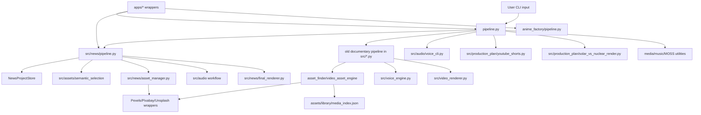
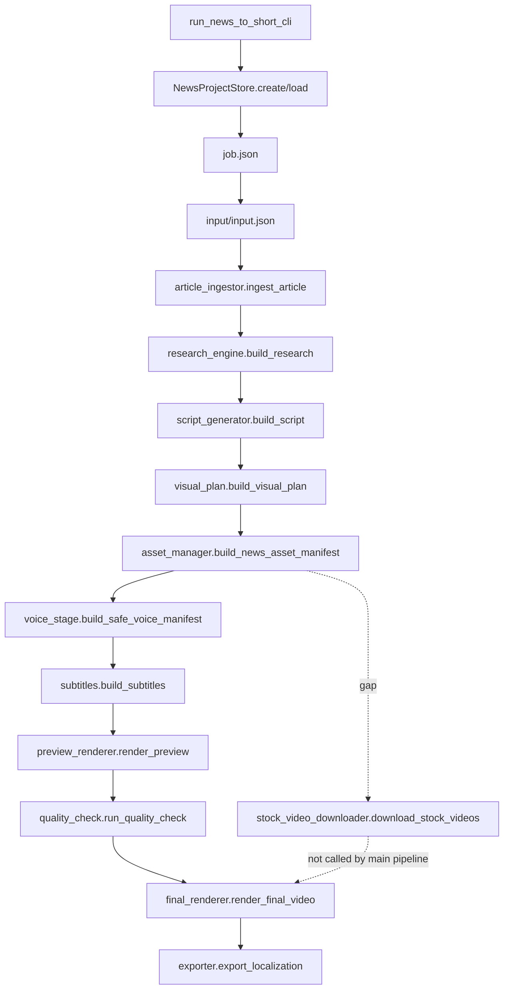
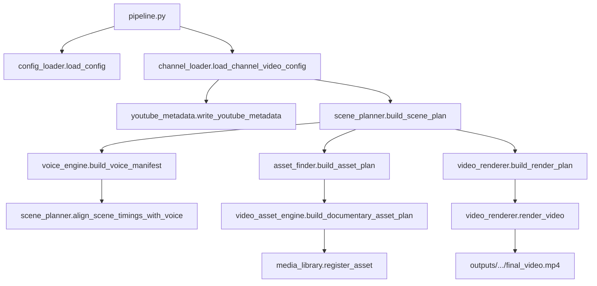
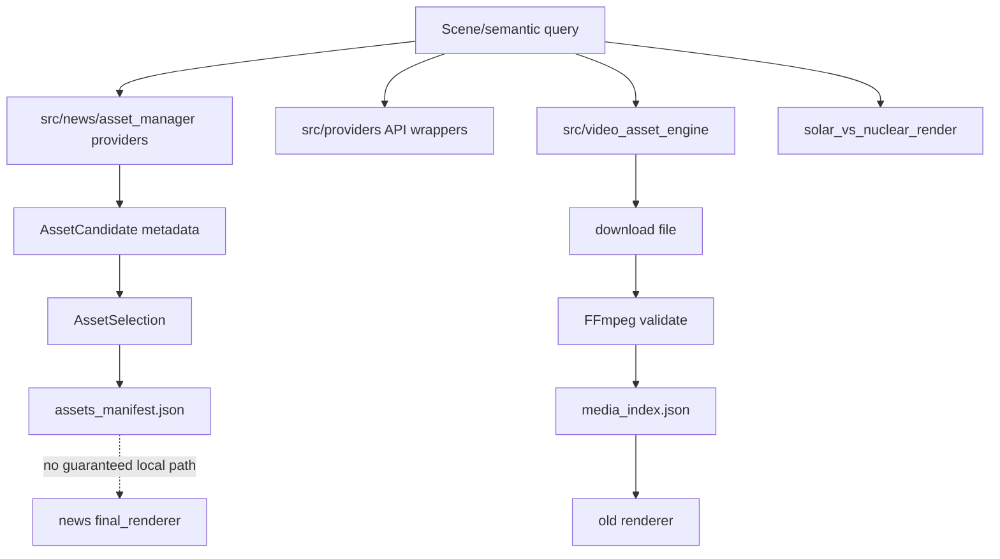
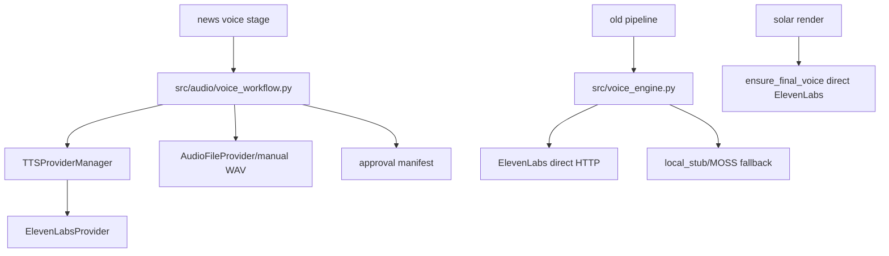
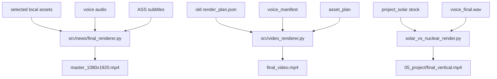
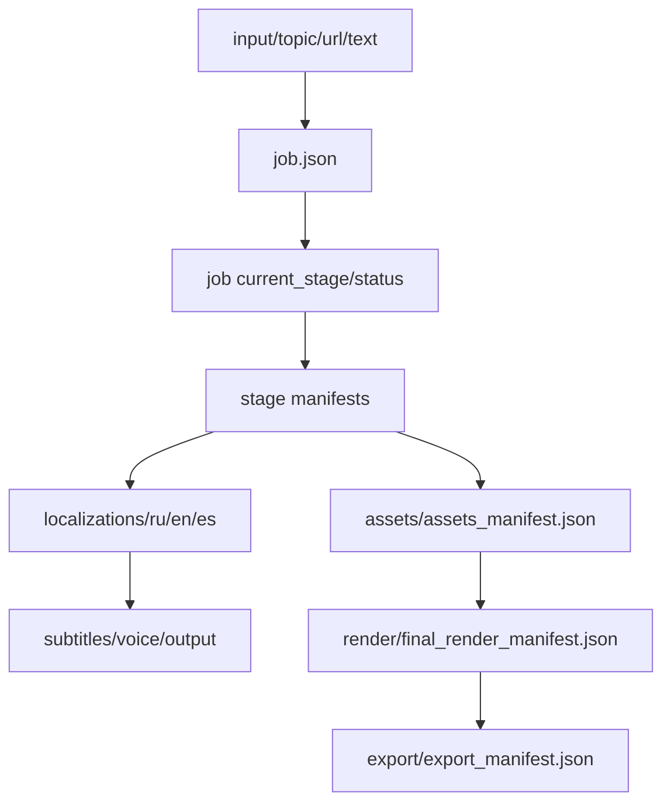

# PROJECT AUDIT ARCHITECTURE

## 1. Folder map

```text
G:\Projects\AI-YouTube
  pipeline.py                         # root CLI dispatcher
  requirements.txt                    # Python dependencies
  .env / .env.example                 # secrets/config names
  src/                                # main Python modules
    news/                             # staged news-to-short pipeline
    assets/semantic_selection/        # semantic scene/query/ranking prototype
    providers/                        # official API wrappers
    audio/                            # safer voice workflow
    production_plan/                  # solar_vs_nuclear experiment
    tts_providers/                    # MOSS provider
    *.py                              # old documentary/render/media modules
  apps/                               # thin app wrappers
  anime_factory/                      # separate anime clip workflow
  channels/                           # channel configs and voices
  config/                             # global style config
  content/                            # old pipeline content input
  projects/                           # generated news projects
  project_solar_vs_nuclear/           # fixed project data
  assets/                             # media library/downloaded/generated data
  outputs/                            # old pipeline generated outputs
  manual_assets/                      # manually supplied files
  legacy/                             # older scripts
  tests/                              # unittest files, not run
  docs/                               # docs, plans, app notes
```

## 2. Module map

| Area | Files | Responsibility |
|---|---|---|
| Root CLI | `pipeline.py` | dispatch all major modes |
| Config | `src/config_loader.py`, `src/channel_loader.py` | load old global/channel/video configs |
| Old script/scene | `src/quote_generator.py`, `src/scene_planner.py`, `src/youtube_metadata.py` | deterministic old content planning |
| Old assets | `src/asset_finder.py`, `src/video_asset_engine.py`, `src/media_library.py` | image/video search, local cache, stock download |
| Old voice | `src/voice_engine.py` | ElevenLabs/local_stub/MOSS voice generation |
| Old render | `src/video_renderer.py`, `src/music_tools.py`, `src/music_engine.py` | MoviePy/FFmpeg render and music |
| News domain | `src/news/models.py` | dataclasses/enums for news projects |
| News store | `src/news/project_store.py` | project folders and manifests |
| News stages | `src/news/pipeline.py` | staged pipeline orchestration |
| News ingestion | `src/news/article_ingestor.py`, `src/news/article_parser.py` | URL/text/topic ingestion and image extraction |
| News script | `src/news/research_engine.py`, `src/news/script_generator.py` | heuristic claims and script |
| News visuals | `src/news/visual_plan.py`, `src/news/asset_manager.py`, `src/news/stock_video_downloader.py` | visual plan, asset selection, standalone download |
| Semantic visuals | `src/assets/semantic_selection/*.py` | semantic schema, query generation, metadata ranking |
| Providers | `src/providers/*.py` | Pexels/Pixabay/Unsplash API wrappers |
| News voice/subtitles/render/export | `src/news/voice_stage.py`, `src/news/subtitles.py`, `src/news/final_renderer.py`, `src/news/exporter.py` | voice gate, subtitles, render, export |
| Safe audio workflow | `src/audio/*.py` | TTS provider abstraction, approval, import |
| Production plan | `src/production_plan/*.py` | fixed solar-vs-nuclear planning/render |
| Anime | `anime_factory/pipeline.py`, `anime_factory/modules/*.py` | local video analysis and clip creation |
| Legacy | `legacy/*.py` | older OpenAI/Pexels/render scripts |

## 3. Overall architecture



Факт из кода: `pipeline.py` является главным dispatcher и содержит несколько независимых веток. Вывод: архитектура сейчас не монолитный продукт, а набор связанных и частично дублирующих CLI-workflows.

## 4. Dependency map

Главные зависимости:

- `requests` для HTTP API и downloads;
- `python-dotenv` для env;
- `openai` для legacy LLM scripts;
- `elevenlabs` dependency присутствует, но основной HTTP-код использует `requests`;
- `moviepy`, `imageio-ffmpeg`, FFmpeg/FFprobe for rendering and validation;
- `Pillow`, `numpy` для изображений/рендера;
- `PyYAML` для voice/channel configs.

Циклических импортов на уровне статического чтения не выявлено как явной проблемы, но есть архитектурное дублирование: providers/downloaders/renderers не имеют одного центра.

## 5. Entry points

| Path | Calls | Returns/creates |
|---|---|---|
| `pipeline.py::main()` | dispatches by CLI args | outputs/projects/assets depending on branch |
| `apps/news_to_short/main.py::main()` | `src.news.pipeline.run_news_to_short_cli` | news project files |
| `apps/news_to_short/__main__.py` | wrapper main | same |
| `apps/youtube_pipeline/main.py::main()` | `pipeline.main` | old pipeline outputs |
| `apps/anime_factory/main.py::main()` | `anime_factory.pipeline.main` | anime project outputs |
| `anime_factory/pipeline.py::main()` | anime modules | clips/previews/reports |
| `legacy/main.py` | OpenAI legacy scene generation | legacy JSON |

## 6. News-to-short pipeline diagram



## 7. Старый documentary pipeline diagram



## 8. Asset/provider flow



Факт: `src/news/asset_manager.py` содержит `AssetProvider` Protocol только с `search()`. Рекомендация: будущий интерфейс должен включать search, preview, download, license, validation, diagnostics.

## 9. Voice flow



## 10. Render flow



## 11. Project data flow



## 12. Domain models

### News models

Defined in `src/news/models.py`:

- `NewsInputType`;
- `NewsPipelineStage`;
- `NewsJobStatus`;
- `NewsAssetType`;
- `NewsSource`;
- `NewsInput`;
- `NewsProject`;
- `ArticleImage`;
- `ResearchClaim`;
- `NewsScene`;
- `NewsScript`;
- `VisualPlanItem`;
- `AssetCandidate`;
- `AssetSelection`;
- `NewsAssetManifest`;
- `VoiceManifest`;
- `SubtitleManifest`;
- `QualityReport`;

Short schema:

```json
{
  "NewsProject": {
    "project_id": "string",
    "root_dir": "string",
    "input": "NewsInput",
    "languages": ["ru", "en", "es"],
    "target_duration_sec": 45,
    "status": "created|running|needs_review|completed|failed",
    "current_stage": "input|article_ingestion|..."
  }
}
```

### Semantic models

Defined in `src/assets/semantic_selection/models.py`:

```json
{
  "SemanticScene": {
    "subject": "string",
    "secondary_subjects": [],
    "action": "string",
    "environment": "string",
    "location": "string",
    "camera": "string",
    "mood": "string",
    "must_include": [],
    "should_include": [],
    "must_not_include": [],
    "visual_priority": "exact_subject|exact_action|environment|research_context|abstract_explanation|transition",
    "fallback_level": 0
  }
}
```

### Media library record

Created/normalized in `src/media_library.py`:

```json
{
  "id": "string",
  "type": "video|image|music",
  "provider": "pexels|pixabay|local",
  "source_url": "string",
  "download_url": "string",
  "local_path": "string",
  "thumbnail_path": "string",
  "original_query": "string",
  "keywords": [],
  "mood": "string",
  "width": 1920,
  "height": 1080,
  "duration": 10.0,
  "fps": 30,
  "license_note": "string",
  "downloaded_at": "string",
  "used_in": []
}
```

Проблема: нет обязательных `author`, `rights_status`, `license_url`, `commercial_use_allowed`, `attribution_required`, `checksum`, `project_id`, `scene_id`.

## 13. Project storage

`src/news/project_store.py` создаёт staged folders и JSON manifests. Записи выполняются обычной записью JSON, без обнаруженного versioning/migration/atomic temp-rename/lock слоя.

Существующие проекты в `projects/` показывают, что статусы могут расходиться с файлами: есть проекты со статусом `completed`, но без финального MP4, и проекты с `current_stage` не равным финальному export.

## 14. Configuration hierarchy

Old pipeline:

1. `config/video_style.json`
2. `channels/<channel>/channel_config.json`
3. `content/<channel>/<video>.json` or `scene_notes.json`
4. CLI mode flags
5. env variables

News:

1. CLI args
2. `.env` provider/voice keys
3. optional channel voice configs through voice workflow
4. project manifests

Anime:

1. `anime_factory/config.yaml`
2. CLI args
3. existing project outputs if reuse flags are used

Проблема: нет единого config registry и typed validation.

## 15. Provider architecture

Факт: два разных слоя providers:

- `src/providers/*.py`: API wrappers for Pexels/Pixabay/Unsplash.
- `src/news/asset_manager.py`: news-specific providers implementing `search()`.

`AssetProvider` в news:

```python
class AssetProvider(Protocol):
    name: str
    def search(self, query: str, asset_type: NewsAssetType, *, limit: int = 8) -> list[AssetCandidate]:
        ...
```

Отсутствуют contract methods:

- `get_preview()`;
- `download()`;
- `get_license()`;
- `validate_asset()`;
- `rate_limit_status()`;
- `diagnostics()`.

Вывод: добавить Wikimedia/NASA/Internet Archive без предварительного интерфейса можно, но каждое подключение будет требовать изменений в search, download, license, render и tests.

## 16. Asset architecture

Существуют минимум четыре схемы ассетов:

- `NewsAssetManifest` / `AssetCandidate` / `AssetSelection` in `src/news/models.py`;
- semantic candidates in `src/assets/semantic_selection/models.py`;
- media library record in `src/media_library.py`;
- production plan selected sources in `project_solar_vs_nuclear/03_stock/selected_sources.json`.

Проблема: данные теряются между схемами. Например candidate может иметь `source_url`, но после выбора/render ожидания могут требовать `path` или `downloaded_path`.

## 17. License architecture

Фактического отдельного license store или database нет. Лицензии представлены строками в разных manifests:

- `license`, `license_note`, `rights_status`, `allowed_for_render`, `attribution` в отдельных местах;
- media library имеет `license_note`, но не полноценный license object;
- article images получают `unknown/reference_only`;
- user assets получают `user_owned`.

Вывод: происхождение файлов можно доказать частично, но не для каждого файла в юридически пригодном виде.

## 18. Voice architecture

Существуют три voice paths:

1. Safe workflow: `src/audio/*` + `src/news/voice_stage.py`.
2. Old workflow: `src/voice_engine.py`.
3. Solar-specific workflow: `src/production_plan/solar_vs_nuclear_render.py`.

Safe workflow лучше как будущая основа, потому что содержит approval/manual import, но он ещё не является единым voice engine для всего проекта.

## 19. Render architecture

Рендеры разделены:

- `src/news/final_renderer.py`: FFmpeg vertical 1080x1920, center crop, ASS subtitles, optional music manifest.
- `src/news/preview_renderer.py`: делает preview из уже существующего final output.
- `src/video_renderer.py`: old MoviePy/FFmpeg render plan.
- `src/production_plan/solar_vs_nuclear_render.py`: fixed solar vertical render.
- `anime_factory/modules/render_clips.py`: anime clip render.

Проблема: нет общего render contract, preview contract, crop strategy interface, output validation layer.

## 20. Localization architecture

News project folders создаются для `ru`, `en`, `es`, но translation/adaptation pipeline не найден. На практике stage dispatch работает с одним `project.input.language`. Общий visual master потенциально может переиспользоваться, но полноценная независимая локализация voices/subtitles/final files не реализована как complete multi-language product.

## 21. Error handling architecture

Встречаются:

- `requests.get/post(..., timeout=...)` в большинстве внешних вызовов;
- `raise_for_status()` в provider wrappers;
- broad `except Exception` и `pass` в downloader/project-specific code;
- missing assets manifests instead of hard failure в news;
- quality gate before final render.

Нет общей retry/backoff/rate-limit policy, error taxonomy, structured logs, retryable/non-retryable classification, atomic state transition.

## 22. Test architecture

Тесты находятся в `tests/`, преимущественно `unittest`. Покрывают news models/pipeline/assets/render, semantic selection, media library, voice workflow, production plan, anime, apps structure. Тесты в рамках аудита не запускались. CI-конфигурации не найдены.

## 23. Дублирование и сильная связанность

Дублируется:

- Pexels/Pixabay search/download: `src/news/asset_manager.py`, `src/news/stock_video_downloader.py`, `src/video_asset_engine.py`, `src/asset_finder.py`, `src/production_plan/solar_vs_nuclear_render.py`, `legacy/download_broll.py`;
- render: `src/news/final_renderer.py`, `src/video_renderer.py`, `solar_vs_nuclear_render.py`, `anime_factory/modules/render_clips.py`;
- TTS: `src/audio/elevenlabs_provider.py`, `src/voice_engine.py`, `solar_vs_nuclear_render.py`;
- subtitle generation: `src/news/subtitles.py`, anime subtitles, solar subtitles.

Сильная связанность:

- news visual heuristics заточены на whales/ocean/research/nature;
- solar renderer знает project folder layout и stock categories;
- old pipeline config/content/output assumptions в одном dispatcher.

## 24. Dead code / legacy areas

Не доказано, что эти части вызываются из current main path:

- `legacy/*.py`;
- `legacy/download_broll.py`;
- часть old image flow в `src/asset_finder.py` when documentary video_task false;
- future provider references in docs/configs;
- static preview/report files not connected to UI.

## 25. Возможные будущие границы модулей

Рекомендация:

- `core/projects`: ProjectStore, schema versioning, migrations, atomic writes.
- `core/assets`: Asset, AssetCandidate, AssetSelection, AssetLicense, provenance.
- `providers`: StockProvider contract with search/preview/download/license.
- `pipelines/news`: orchestration only.
- `pipelines/documentary`: old pipeline isolated or migrated.
- `audio`: one approved TTS/manual/import flow.
- `render`: RenderJob, RenderAsset, crop strategies, validation.
- `ui`: project review and manual asset replacement.

