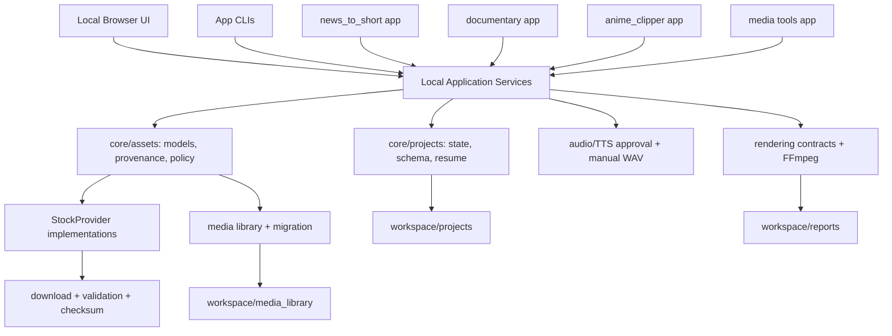

# Target Architecture

This document describes the target structure for AI-YouTube. It is a plan for future migration only. No folders are moved in the Provider Foundation hardening stage.

## Recommendation

Use `src/news` as the first primary production pipeline because it already has staged project state, localization folders, safe voice approval, asset manifests, quality check and final render boundaries. Keep the old documentary pipeline, solar experiment and anime factory as separate applications until their schemas are migrated behind shared core contracts.

The future UI should be a local web UI opened in the user's browser. A browser UI fits this project better than a desktop-only app because the workflow is review-heavy: project lists, scene tables, video previews, candidate previews, replacement actions, voice audition and progress are easier to build and test as local web screens. It must use a backend service layer instead of reading/writing temporary JSON directly.

## Target Folder Shape

```text
apps/
  news_to_short/
  documentary/
  anime_clipper/
  media_tools/
  local_ui/

src/
  core/
    projects/
    config/
    logging/
    filesystem/
  assets/
    models.py
    provider_contract.py
    license_policy.py
    provenance.py
    download.py
    diagnostics.py
  providers/
    pexels/
    pixabay/
    local_library/
    manual/
    future/
  pipelines/
    news_to_short/
    documentary/
    anime_clipping/
  audio/
    tts/
    voice_workflow/
    manual_audio/
  rendering/
    ffmpeg/
    subtitles/
    preview/
    final/
  media_tools/
    conversion/
    cleanup/
    thumbnails/
  ui_api/
    services/
    schemas/
    routes/

channels/
  presets/
  niches/
  voices/

workspace/
  projects/
  media_library/
  reports/
  cache/
  temp/

tests/
docs/
legacy/
```

## Application Boundaries

Separate applications:

- `news_to_short`: creates short news/science/social videos from topic, URL or text.
- `documentary`: long-form or scripted documentary/quote production.
- `anime_clipper`: local anime episode analysis, candidate scoring and clip rendering.
- `media_tools`: conversion, thumbnails, cleanup, local media indexing and diagnostics.
- `local_ui`: browser UI and local backend for review/control.

Each app owns orchestration and UX-specific commands. Apps should not own provider HTTP logic, license decisions, download validation, TTS policy or renderer primitives.

## Shared Core

Shared core modules:

- Project storage, schema versions, atomic writes, stage status, resume and cancellation.
- Asset models, provider contract, license policy, provenance and checksum records.
- Download and validation helpers, including `.part` writes, atomic replace, SHA-256, content checks, Pillow and FFprobe validation.
- TTS provider contracts, paid-call approval and manual WAV import.
- Render contracts, FFmpeg helpers, subtitles, output validation and preview/final manifests.
- Diagnostics, structured errors and secret-safe status reporting.

Modules that must not be duplicated:

- Provider search/download/license policy.
- Media library schema and migration.
- Paid TTS approval.
- FFmpeg command construction and output validation.
- Project stage state and JSON schema migrations.
- Source/provenance and attribution reporting.

## Data Locations

Channel topics and niches:

- Store reusable channel identity, voice choices, language policy and style in `channels/presets/`.
- Store niche/topic packs in `channels/niches/`.
- Do not hide channel strategy inside pipeline code.

Generated projects:

- Target: `workspace/projects/<app>/<project_id>/`.
- Current compatibility: keep reading existing `projects/` and `project_solar_vs_nuclear/` through wrappers.

Media assets:

- Target: `workspace/media_library/`.
- Keep source media, thumbnails, metadata, quarantine and manual proof attachments under one versioned library root.
- Current compatibility: keep reading `assets/library/metadata/media_index.json`; do not auto-migrate.

Reports:

- Target: `workspace/reports/` for generated runtime reports.
- Implementation/audit docs remain under `docs/implementation/` and `docs/architecture/`.

Cache and temp:

- Target: `workspace/cache/` and `workspace/temp/`.
- Generated render intermediates and partial downloads should have lifecycle policy and cleanup commands.

## License And Provenance

The license system is shared core, not provider-owned.

Required final visual fields:

- Provider.
- Provider asset id.
- Media type.
- Source page URL.
- Download URL when remote.
- Author when known.
- License name and URL.
- Provider terms URL.
- Commercial use flag.
- Modification flag.
- Attribution flag/text.
- Owner approval status.
- Review-required flag.
- Policy version and reviewed date.
- Policy decision reason.
- SHA-256.
- Technical validation.
- Project id and scene id.

Unknown rights, missing source, missing provider asset id and legacy schema records are review-required by default.

## Future Local Web UI

Build the UI after the service layer exists. Do not build it directly on temporary JSON files because JSON files are storage artifacts, not a stable product API. Direct JSON coupling would freeze current folder names, allow partial writes to look like valid states, bypass license policy checks and make resume/cancellation unreliable.

The minimal local UI should support:

- Project list.
- Stage status.
- Scene list.
- Scene text.
- Voice duration per scene.
- Selected material.
- Three to five alternatives.
- Material preview.
- Source and license display.
- Replace button.
- Upload own file.
- Manual rights confirmation.
- Open Envato search.
- Voice status.
- Voice audition.
- Manual WAV import.
- Subtitle status.
- Video preview.
- Final render status.
- Progress.
- Clear errors.
- Resume.
- Cancellation.

Backend contracts needed before UI:

- `ProjectService`: list, open, create, resume, cancel, stage status.
- `SceneService`: list scenes, read scene text/timing, update scene asset choice.
- `AssetService`: search providers, list alternatives, preview asset, download/validate selected asset.
- `LicenseService`: evaluate policy, store manual rights declaration, require owner approval.
- `VoiceService`: status, audition, import manual WAV, approval records.
- `RenderService`: preview render, final render, progress, cancellation.
- `DiagnosticsService`: provider diagnostics, media-library migration dry-run, environment presence without secrets.

The UI boundary should call these services through a local HTTP API or equivalent application service interface. Storage stays behind services.

## Compatibility Wrappers

Keep wrappers during migration:

- `pipeline.py` keeps dispatching old commands until app-specific CLIs are stable.
- `apps/news_to_short` keeps calling the current news pipeline until it moves under `src/pipelines/news_to_short`.
- Legacy Pexels/Pixabay functions remain importable while new code uses `StockProvider`.
- Existing `projects/`, `assets/library/metadata/media_index.json`, `outputs/` and `project_solar_vs_nuclear/` remain readable.
- Old documentary and solar renderers stay isolated until render contracts are migrated.

## Safe Migration Sequence

1. Freeze schemas with tests and network guard.
2. Keep Provider Foundation stable: policy, diagnostics, migration dry-run.
3. Add project service layer over current JSON storage.
4. Add asset service layer over provider search/download/license decisions.
5. Add media-library migration apply workflow with backups and rollback.
6. Move `src/news` under `src/pipelines/news_to_short` behind wrappers.
7. Move old documentary code behind a separate app boundary.
8. Move render helpers into shared rendering only after tests cover Windows and Unicode paths.
9. Move audio/TTS under one paid-call approval system.
10. Build local web UI on service contracts.
11. Add Wikimedia, NASA, Internet Archive and Envato Manual Provider after policy/service contracts are stable.
12. Mark legacy modules deprecated, then delete only after import maps and user project compatibility are verified.

## Diagram



