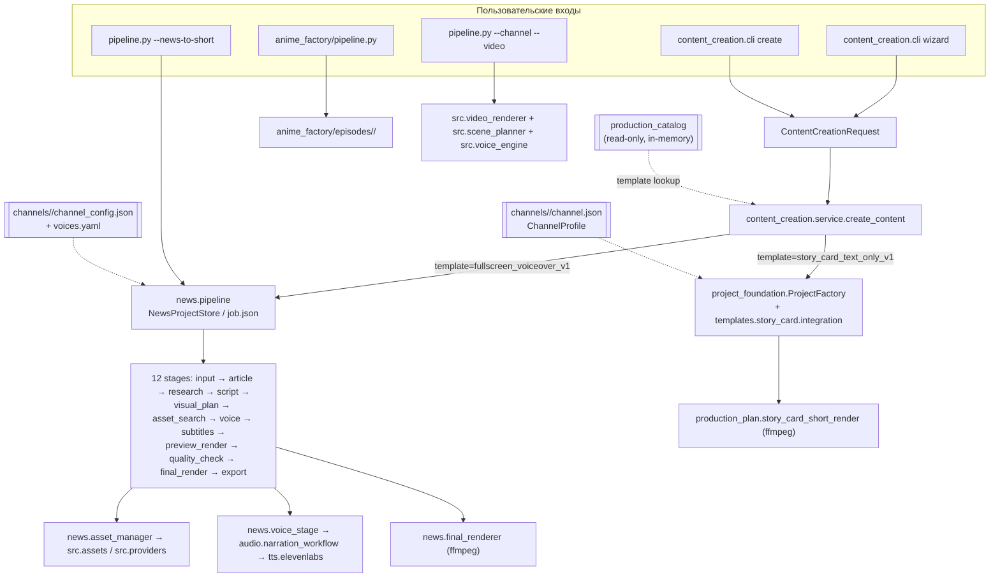

# Autonomous Architecture Audit

Дата аудита: 2026-07-25. Ветка `master`, HEAD `b9cdc8b`.
Метод: read-only чтение кода, manifests, тестов, документации и Git. Python-код на фазе
аудита не изменялся. Платные вызовы, сеть, downloads и renders не выполнялись.

> **Внимание.** Этот файл фиксирует состояние **на момент аудита**. Часть найденных
> дефектов уже исправлена в этой же сессии (этапы A, B1, B2, C1, E1) — что именно
> изменилось, см. `docs/handoff/AUTONOMOUS_PROGRESS.md`. Разделы ниже намеренно не
> переписаны задним числом: они объясняют, почему были сделаны исправления.

Маркировка утверждений:

- **VERIFIED FACT** — подтверждено чтением кода/файлов/выводом read-only команды.
- **INFERENCE** — логический вывод из фактов, но без прямой проверки.
- **RECOMMENDATION** — предложение.
- **UNKNOWN** — требует отдельной проверки.

---

## 1. Executive Summary

### Что это за проект

AI-YouTube — локальная система производства видео. Фактически в репозитории живут
**четыре независимых приложения**, объединённых только общей папкой `src/`:

1. **content_creator / news_to_short** — staged pipeline тема→статья→research→сценарий→
   визуальный план→поиск ассетов→озвучка→субтитры→QC→рендер→экспорт. Это самый зрелый путь.
2. **story_card_text_only_v1** — изолированный renderer карточки поверх локального видеофайла.
3. **legacy channel/video pipeline** (`pipeline.py --channel X --video Y`) — старый
   документальный/цитатный рендер (quotes, psychology, survival, size_comparison).
4. **anime_factory** — самостоятельный video repurposer с собственным episode-хранилищем.

### Насколько близко к цели

**VERIFIED FACT.** Один сквозной путь действительно работает end-to-end и производит
готовое видео. Проект
`projects/в_видео_используются_архивные_стоковые_материалы_карты_авторская_20260724T214350`
содержит: `article.json`, `claims.json`, `script.json`, `visual_plan.json`,
`assets_manifest.json` с 6 скачанными ассетами и лицензиями, `narration.wav` (59.47 s,
реальный ElevenLabs), `subtitles.ass`, `quality_report.json` status=`passed`,
`final_render_manifest.json` status=`completed` и 5 выходных MP4 (master, youtube_shorts,
instagram_reels, facebook_reels, no_subtitles).

Оценка готовности к заявленной цели: **примерно 45–55 %**. Есть настоящий production-путь
для одного формата и одного шаблона; отсутствуют longform, video_repurposer как приложение,
единая project-модель, музыка и честная синхронизация.

### Сильные стороны

- Реальный, проверенный end-to-end путь для `fullscreen_voiceover_v1`.
- Дисциплина платных вызовов: платный TTS физически не может выполниться без `approval.json`
  на диске (`narration_workflow.generate_final` → `PermissionError`).
- Богатый asset-слой: provider contract, license policy, provenance, checksums, preview,
  semantic/temporal анализ, review bundles.
- Хорошая тестовая база: 68 тестовых модулей, глобальный `tests/network_guard.py`
  блокирует внешнюю сеть в обычных тестах.
- Кеш озвучки по сценам (`generation_key`) — повторный запуск не тратит credits заново.

### Главные противоречия

1. **Два CLI-корня.** `CLAUDE.md` называет `pipeline.py` главным entrypoint, но реальный
   пользовательский CLI создания контента — `python -m src.content_creation.cli`, и он
   **не подключён к `pipeline.py`** (VERIFIED: в `pipeline.py` нет импорта `content_creation`).
2. **Две project-системы в одной папке `projects/`**: `NewsProjectStore` (`job.json`, 19
   проектов) и `ProjectFactory` (`project.json`, 1 проект). Команда
   `cli project status --project-id <news_job>` падает с сырым traceback.
3. **Production Catalog не является source of truth.** Его metadata для
   `story_card_text_only_v1` описывает чужой workflow, а `implementation_status` шаблонов
   противоречит `capabilities.TEMPLATE_TESTED_STATUS`.
4. **Wizard задаёт вопросы, которые никуда не идут**: timing mode, voice mode, музыка.
5. **Документация handoff устарела** — описывает как «планируемое» то, что уже сделано.

### Главные риски

- **R1 (качество продукта, высокий).** Видеоряд и субтитры считаются по *плановой*
  длительности сцен, а не по реальной озвучке → рассинхрон. См. §6.
- **R2 (ложные возможности, высокий).** Wizard предлагает 6 каналов, из которых 4 —
  legacy-каналы старого pipeline, непригодные для news_to_short; и формат `longform`,
  у которого нет ни одного шаблона (wizard в этом месте аварийно завершается).
- **R3 (project storage, средний).** Пока нет общего read-интерфейса, любой UI придётся
  писать дважды.
- **R4 (глобальный voice_id из .env, средний).** `load_voice_profiles` подменяет `voice_id`
  любого elevenlabs-профиля значением из окружения — multi-voice невозможен.

### Наиболее рациональный следующий этап

**Stage B1 — narration-aligned scene timing.** Это единственное изменение, которое напрямую
улучшает качество готового видео, полностью переиспользует существующие manifests, не
требует ни сети, ни платных вызовов, ограничено 3–4 файлами и проверяется targeted-тестами.

---

## 2. Current Architecture Map

### Entrypoints (VERIFIED FACT)

| Entrypoint | Что запускает | Статус |
|---|---|---|
| `pipeline.py` | legacy channel/video render, news_to_short, voice CLI, media-library, provider/semantic/preview диагностика, production catalog read-only, solar production plan | активный, но перегруженный (~50 флагов в одном argparse) |
| `python -m src.content_creation.cli` | **единый CLI создания контента + wizard** | активный, **не подключён к `pipeline.py`** |
| `python -m src.project_foundation.cli` | channels/projects read-only | активный |
| `anime_factory/pipeline.py` | video repurposer | активный, полностью автономный |
| `apps/<app>/main.py` | тонкие обёртки | `youtube_pipeline` → `pipeline.main()`; `news_to_short` → свой argparse; `anime_factory` → своя обёртка |



### Manifests, которые реально пишутся (VERIFIED FACT)

news_to_short проект: `job.json`, `input/input.json`, `article/article.json`,
`research/claims.json`, `localizations/<lang>/script/script.json`,
`localizations/<lang>/visual/visual_plan.json`, `master/master_visual_plan.json`,
`assets/assets_manifest.json`, `assets/missing_assets.json`, `assets/ATTRIBUTION.md`,
`assets/sources.json`, `localizations/<lang>/voice/voice_manifest.json` (+ `voice_selection.json`,
`approval.json`, `scenes/*.mp3` + sidecar json, `narration.wav`),
`localizations/<lang>/subtitles/subtitles.{srt,ass,_manifest.json}`,
`preview/preview_manifest.json`, `quality/quality_report.json`,
`render/final_render_manifest.json`, `localizations/<lang>/output/*.mp4`.

story_card проект: `project.json`, `outputs/story_card_render_request.json`,
`outputs/story_card_short.mp4`, `outputs/story_card_preview.png`.

**Отсутствуют, но объявлены**: `assets/music/music_manifest.json` (читается
`final_renderer._load_music_manifest`, **никем не пишется** — VERIFIED),
`evidence/evidence_manifest.json` для news-проектов (EvidenceBundle используется только в
project_foundation-ветке).

---

## 3. Canonical Components Matrix

| # | Ответственность | Source of truth сейчас | Статус | Кто использует | Параллельные реализации | Legacy | Рекомендация |
|---|---|---|---|---|---|---|---|
| 1 | Project model | **два**: `src/news/project_store.py` (`job.json`) и `src/project_foundation/projects.py` (`project.json`) | production / production | news_to_short / story_card | да, обе живые | — | Stage C: общий read-only `ProjectRepository`, без третьей системы |
| 2 | Channel model | **два**: `project_foundation/channels.py` (`channel.json`) и `news/pipeline._load_channel_config` (`channel_config.json`) | production | story_card / news_to_short | + `src/channel_loader.py` (legacy pipeline) — третья | `channel_loader.py` | Stage D: единый resolver с tolerant reader |
| 3 | Production Catalog | `src/production_catalog/catalog.py` | production (read-only, in-memory) | service, wizard, capabilities | нет | — | сделать честным (см. §8) |
| 4 | ContentCreationRequest | `src/content_creation/models.py` | production | cli, wizard | нет | — | оставить каноном; убрать мёртвые поля |
| 5 | Application service | `src/content_creation/service.py` | production | cli, wizard | нет | — | это будущий UI service layer |
| 6 | Stage state | `NewsJob.stages` в `job.json` | production | news_to_short | story_card стадий не имеет | — | расширять только news-модель |
| 7 | Resume | `run_news_to_short_job(resume=True)` + `completed_stage_names` | production | оба CLI | нет | — | ок |
| 8 | Asset provider contract | `src/assets/provider_contract.py` | production | `src/providers/*` | `news/asset_manager.PexelsAssetProvider/PixabayAssetProvider/UnsplashAssetProvider` — **второй, встроенный контракт** | — | duplicate_candidate, см. §8 |
| 9 | Provider routing | `src/assets/provider_routing.py` | production | asset_manager | — | — | ок |
| 10 | Asset search | `src/news/asset_manager.build_assets_manifest` (1026 строк) | production | news_to_short | — | — | слишком крупный, но рабочий; не трогать без нужды |
| 11 | Asset download | `src/assets/download.py` + `_ensure_selected_asset_downloaded` | production | asset_manager | `src/news/stock_video_downloader.py` | вероятно legacy | проверить и пометить |
| 12 | Semantic selection | `src/assets/semantic_selection/` | production | asset_manager | — | — | ок |
| 13 | Visual preview | `src/assets/visual_preview.py` | production | pipeline.py CLI | — | — | ок |
| 14 | Semantic visual analysis | `src/assets/semantic_visual_service.py` (+ openai/mock backends) | production, live-проверен | pipeline.py CLI | — | — | ок |
| 15 | License policy | `src/assets/license_policy.py` + `config/license_policy.json` | production | asset_manager, quality_check | — | — | ок |
| 16 | Provenance | `src/assets/models.py` (`AssetProvenance`) | production | providers | — | — | ок |
| 17 | Evidence | `src/project_foundation/evidence.py` (`EvidenceBundle`) | production | только story_card/CLI | news-проекты пишут `assets/sources.json` + `ATTRIBUTION.md` | — | Stage C/D: единый rights-report над обеими формами |
| 18 | Media index | `src/media_library.py` (`assets/library/metadata/media_index.json`) | production | legacy + local_library provider | — | — | ок |
| 19 | TTS provider contract | `src/audio/tts/base_provider.py` + `provider_manager.py` | production | narration_workflow | `src/tts_providers/moss_tts_provider.py`, `src/voice_engine.py` (local_stub) | оба legacy/experiment | не предлагать в UI (уже соблюдено) |
| 20 | Voice profile registry | `src/audio/voice_profile_registry.py` | production | capabilities, voice_adapter | нет второго registry | — | ок, но см. дефект D6 |
| 21 | Voice policy | `src/audio/voice_policy.py` | production | voice_adapter | — | — | ок |
| 22 | Paid approval | `src/audio/voice_workflow.py` (`approval.json`, hash-bound) | production | narration_workflow | — | — | ок, сильная сторона |
| 23 | Audition / preflight | `narration_workflow.prepare_final` + `ElevenLabsProvider.preflight` | production | service preflight, voice CLI | — | — | ок |
| 24 | Scene-level generation | `src/audio/scene_voice_generator.py` | production | narration_workflow | — | — | ок |
| 25 | Narration assembly | `src/audio/audio_assembler.py` | production | narration_workflow | — | — | ок |
| 26 | Pause policy | `src/audio/pause_policy.py` | production | narration_workflow | — | — | ок |
| 27 | End-tail policy | `src/audio/end_tail_policy.py` | production | final_renderer | — | — | ок |
| 28 | Subtitle generation | `src/news/subtitles.py` | mock_tested | news_to_short | `channels/*/subtitle_style.json` не читается | — | Stage B1 исправляет тайминг |
| 29 | Subtitle timing | **отсутствует** — арифметическое деление | **дефект** | — | — | — | Stage B1 |
| 30 | Music | `final_renderer._mux_voice_and_music` (ducking есть!) | **unreachable** — `music_manifest.json` никто не пишет | — | `src/music_engine.py`, `src/music_finder.py` (legacy pipeline) | — | Stage E: тонкий music stage, не новый engine |
| 31 | Sound effects | отсутствует | planned | — | — | — | не начинать |
| 32 | Renderer | `src/news/final_renderer.py` (v2) и `src/production_plan/story_card_short_render.py` | production | по шаблонам | `src/video_renderer.py`, `src/layout_renderer.py`, `solar_vs_nuclear_render.py`, `size_comparison_engine.py` | legacy/experiment | оставить, не расширять legacy |
| 33 | Quality control | `src/news/quality_check.py` | production | news_to_short | `src/self_eval.py` (legacy) | `self_eval` | ок |
| 34 | Export | `src/news/exporter.py` + `_copy_platform_outputs` | production | news_to_short | — | — | экспорт = копии master (см. §4) |
| 35 | Output reporting | `src/content_creation/output_report.py` | production | cli, wizard | — | — | ок |
| 36 | CLI | `src/content_creation/cli.py` | production | пользователь | `pipeline.py` | — | Stage A: явно задокументировать оба |
| 37 | Wizard | `src/content_creation/wizard.py` | production | пользователь | — | — | Stage B2 |
| 38 | Application adapters | `apps/*/main.py` | тонкие обёртки | тесты | — | — | ок |

---

## 4. Formats and Templates Matrix

| Application | Format | Template | Runtime path | Voice | Subtitles | Music | Assets | Renderer | Final MP4 | Test status | Ограничения |
|---|---|---|---|---|---|---|---|---|---|---|---|
| content_creator | vertical_short | `fullscreen_voiceover_v1` | `service._create_fullscreen_voiceover` → `news.pipeline` (12 стадий) | ElevenLabs, scene-level, approval-gated | `news/subtitles.py`, burn-in ASS | **нет** (unreachable) | provider search + download + license | `news/final_renderer.py` | **да, подтверждён** | **live_tested** | тайминг сцен плановый, а не по озвучке; music_manifest не создаётся |
| content_creator | vertical_short | `story_card_text_only_v1` | `service._create_story_card` → `templates/story_card/integration` → `story_card_short_render` | нет (audio=False) | нет | нет | **только `--source-asset` вручную** | `production_plan/story_card_short_render.py` | **да** (`projects/project-61958823/outputs/story_card_short.mp4`) | **live_tested** | нет asset search, нет озвучки, нет evidence из провайдеров |
| content_creator | vertical_short | `news_to_short` (workflow, не template) | `pipeline.py --news-to-short` | тот же | тот же | — | тот же | тот же | да | targeted-tested | это workflow, а не отдельный шаблон каталога |
| content_creator | longform | **нет ни одного шаблона** | — | — | — | — | — | — | нет | **broken UX** | формат `enabled=True`, но wizard на нём аварийно завершается |
| video_repurposer | horizontal_clip | нет | — | — | — | — | — | — | нет | planned | application `enabled=False` |
| (вне каталога) | vertical_short | Solar (`project_solar_vs_nuclear`) | `pipeline.py --production-plan solar_vs_nuclear` | своя | своя | своя | ручные | `solar_vs_nuclear_render.py` | UNKNOWN | targeted-tested (`test_youtube_shorts_production_plan`) | experiment, вне каталога |
| (вне каталога) | horizontal→vertical | Anime Factory | `anime_factory/pipeline.py` | whisper-транскрипция | SRT | нет | локальный source.mp4 | `anime_factory/modules/render_clips.py` | previews есть, `output/` пуст | targeted-tested (7 модулей) | полностью автономна, не знает про Application/Format/Template |

**VERIFIED FACT.** Export targets — не отдельные рендеры: `_copy_platform_outputs` физически
копирует `master_1080x1920.mp4` в `youtube_shorts.mp4` / `instagram_reels.mp4` /
`facebook_reels.mp4`. `tiktok` и `stories` зарегистрированы в каталоге, но не создаются.
`ExportTargetDefinition.max_duration_sec=None` у всех — ограничения площадок не применяются.

---

## 5. Wizard Assessment

### Фактический flow (VERIFIED, `wizard.fill_all`)

Формат → Шаблон → Канал → Язык → Источник сценария → Целевая длительность (только
fullscreen) → Озвучка (provider → profile → **режим озвучки**) → Субтитры → Музыка →
**Timing mode** → Dry-run → Сводка/редактирование → (preflight → платное подтверждение) → Запуск.

### Что работает хорошо

- Фильтрация шаблонов по формату; сброс зависимых ответов при смене шаблона.
- Отдельный экран preflight **до** платного подтверждения, с реальными цифрами из `script.json`.
- После «Да» продолжается **тот же** `project_id` через resume — второй проект не создаётся
  (VERIFIED: `run_creation_with_preflight` → `state.project_id = result.project_id`).
- Честная разметка статусов: `voice` показывается `completed` только если реально есть
  `audio_path`.
- Явный вывод «Сетевые действия» / «Платные действия» в сводке.

### UX-проблемы и ложные возможности (все VERIFIED)

| # | Проблема | Доказательство |
|---|---|---|
| D1 | **Шаг «Application» отсутствует.** Wizard начинается с формата, хотя каталог и целевая модель начинаются с Application. | `fill_all` |
| D2 | **`longform` — тупик.** Формат `enabled=True`, шаблонов нет → `choose_template` печатает сообщение и выбрасывает `_Cancelled`, **весь wizard завершается**, все ответы теряются. | `catalog._build_formats` + `wizard.choose_template` |
| D3 | **4 из 6 каналов непригодны.** `capabilities.list_channels()` отдаёт `psychology`, `quotes`, `size_comparison`, `survival` как `content_creator` + `default_template=fullscreen_voiceover_v1`. Их `channel_config.json` имеет совсем другую схему (`channel_name`, `video_format`, `obsidian_folder`), нет `mode: news_to_short`, нет `voice`, нет `voices.yaml`. | `capabilities.list_channels` + фактические файлы |
| D4 | **Вопрос «Режим озвучки» ничего не делает.** `request.voice.mode` не читается ни одним workflow. | grep: `voice.mode` не встречается вне models/cli/wizard |
| D5 | **Вопрос «Режим тайминга» ничего не делает.** `request.timing` не читается ни одним workflow. | grep: `.timing` только в конструкторах |
| D6 | **Выбранный голос теряется для канала без своего `voices.yaml`.** `capabilities.resolve_voice_profile` ищет только в `channels/<id>/voices.yaml` и падает, wizard очищает `state.voice_profile` и печатает предупреждение, — хотя `voice_adapter.load_voice_profile_for_channel` умеет глобальный fallback и **успешно** резолвит `ru_dom` для `nature_pulse`. | прямой прогон обеих функций |
| D7 | **Музыка формально предлагается, но всегда принудительно `disabled`** для обоих шаблонов. | `choose_music` |
| D8 | **Название проекта — мусор.** `job_id` строится из `topic or input_text[:80]`, поэтому существуют проекты вида `в_видео_используются_архивные_стоковые_материалы_карты_авторская_...` и `wizard_установил_questionary_единственная_подходящая_библиотека__...`. | `pipeline.create_news_to_short_job` + листинг `projects/` |
| D9 | **Нет шага «Export targets»** — при том, что они есть в каталоге и в `ChannelProfile`. | `fill_all` |
| D10 | Отсутствует resume/продолжение существующего проекта из wizard. | `fill_all` |

### Рекомендуемый итоговый flow (RECOMMENDATION)

1. Application (только `enabled=True`) → 2. Format (только форматы, у которых есть
хотя бы один `enabled` шаблон) → 3. Template → 4. Channel (только совместимые с шаблоном) →
5. Language → 6. Input source → 7. Target duration → 8. Voice (provider + profile;
режим — из template policy, не спрашивать) → 9. Subtitles → 10. Music (показывать только
когда реально подключено) → 11. Export targets → 12. Review/Edit → 13. Preflight →
14. Paid confirm → 15. Run → 16. Output report.

Timing mode и voice output mode **не спрашивать** — это template policy, не пользовательский
выбор.

---

## 6. Voice Diagnosis

### Фактическая цепочка (VERIFIED)

```
wizard/cli --voice-profile
  → ContentCreationRequest.voice.profile        (резолвится через capabilities.resolve_voice_profile)
  → service._create_fullscreen_voiceover
      → run_news_to_short_job(until_stage=asset_search)      ← платного вызова здесь нет
      → _build_paid_preflight_summary                         ← бесплатно, read-only preflight
      → [пользователь подтверждает]
      → _create_paid_voice_approval → voice_workflow.create_voice_approval_record → approval.json
      → run_news_to_short_job(stage=voice, execute_voice=True, voice_profile_override=...)
          → news.voice_stage.build_or_generate_voice_manifest
              → load_approval() ; если None → безопасный stub-манифест
              → voice_adapter.load_voice_profile_for_channel (с глобальным fallback)
              → narration_workflow.generate_final
                  → approval_covers_request() иначе PermissionError
                  → scene_voice_generator.generate_scenes (кеш по generation_key)
                  → audio_assembler.assemble_narration (сцены + паузы)
                  → voice_manifest.build_voice_manifest (schema_version=2)
```

### Ответы на вопросы задания

1. **Где выбирается voice profile** — в wizard (`choose_voice`) или флагом `--voice-profile`;
   каноническое разрешение — `VoiceProfileRegistry.resolve` (id → alias → display_name).
2. **Может ли профиль быть глобальным** — фактически да, но только внутри
   `voice_adapter.load_voice_profile_for_channel` и только при явном override. Единого
   глобального реестра файлов нет: профили лежат в `channels/<id>/voices.yaml`.
3. **Нужен ли `voices.yaml` каждому каналу** — сейчас **да** для канала без override.
   RECOMMENDATION: добавить `config/voices.yaml` как глобальный слой и искать по цепочке
   channel → global.
4. **Где ru_dom / Dom** — `channels/nature_science_news_ru/voices.yaml`, `display_name: Dom`,
   `voice_id: hDfThiytYnsDMuVgm6Qy`, `model_id: eleven_multilingual_v2`. Алиасы `дом`/`dom`
   в `voice_profile_registry.ALIASES`.
5. **Имеет ли project override приоритет** — да: `profile_override or channel_config.voice_profile or "ru_dom"`.
6. **Правильная иерархия** — RECOMMENDATION: `global registry → template policy → channel
   default → project override → localization override`. Сейчас реализованы только
   channel default и project override; template policy применяется отдельно
   (`AUDIO_POLICY_DEFAULTS["fullscreen_voiceover_default"]`), а localization override
   объявлен в `channel_config.languages.<lang>.voice`, но **не читается** (VERIFIED:
   `_load_channel_voice_config` берёт только верхнеуровневый `voice`).
7. **Работает ли resume с override** — в wizard/service **да** (`state.voice_profile`
   сохраняется между двумя вызовами). В `pipeline.py --news-to-short` — **нет**:
   `run_news_to_short_cli` не передаёт `voice_profile_override` и не имеет `--execute-voice`
   (VERIFIED, `src/news/pipeline.py:150-159`).
8. **Когда approval инвалидируется** — `is_final_generation_approved` сверяет хеши текста,
   settings, voice_id, model_id, language. Изменение сценария или настроек делает approval
   недействительным → `PermissionError`. Это корректно.
9. **Почему preflight может показывать пустые поля** — `_build_paid_preflight_summary`
   возвращает `{}` если нет `script.json` или профиль не резолвится
   (`VoiceProfileRegistryError`). Второй случай — прямое следствие дефекта D6.
10. **Второго voice registry нет** (VERIFIED). Есть legacy-провайдеры (`src/voice_engine.py`
    local_stub, `src/tts_providers/moss_tts_provider.py`), но они не зарегистрированы в
    `TTSProviderManager` и не предлагаются в UI.

### Дополнительный риск (VERIFIED FACT)

`src/audio/voice_cli.py:28` — при загрузке профилей `voice_id` любого профиля с
`provider: elevenlabs` **подменяется значением из окружения**, если оно задано:

```python
voice_id=env.voice_id if item.get("provider") == "elevenlabs" and env.voice_id else item.get("voice_id", "")
```

**INFERENCE:** пока профиль один, это незаметно; при добавлении второго голоса все профили
свернутся в один и того же реального диктора. Это скрытый глобальный override.

---

## 7. Project Storage Diagnosis

| | NewsProjectStore | ProjectFactory (Project Foundation) |
|---|---|---|
| Файл-манифест | `job.json` | `project.json` |
| Корень | `projects/<job_id>` | `projects/<project_id>` (тот же!) |
| ID | `<slug темы>_<YYYYMMDDThhmmss>` | `<slug>-<uuid8>` |
| Стадии | 12 стадий с `status/attempts/started_at/result_path/error` | нет |
| Resume | да | нет (создание идемпотентно только через `exists`) |
| Localization | `localizations/<lang>/{script,voice,visual,subtitles,output}` | `localizations/<lang>` (пустая) |
| Evidence | `assets/sources.json`, `assets/ATTRIBUTION.md` | `evidence/` + `EvidenceBundle` + `rights_report()` |
| Assets | `assets/{downloaded,previews,review}` + `assets_manifest.json` | `assets/` (пустая) |
| Outputs | `localizations/<lang>/output/*.mp4` | `outputs/*.mp4` |
| Шаблоны | `fullscreen_voiceover_v1` | `story_card_text_only_v1` |
| Тесты | `test_news_to_short_*` (7 модулей) | `test_project_factory`, `test_project_foundation_*`, `test_story_card_project_integration` |
| Проектов на диске | 19 | 1 |

**Пересечения:** обе живут в `projects/`, обе имеют `assets/`, `localizations/`,
`outputs`-подобные папки, обе хранят `channel_id` и язык.

**Расхождения:** `job.json` не знает `template_id`/`application_id`/`format_id`;
`project.json` не знает стадий и статуса выполнения.

**Безопасная стратегия (RECOMMENDATION, Stage C):**

1. Ввести **read-only** `ProjectRepository` в новом небольшом модуле, который определяет тип
   проекта по наличию `job.json` / `project.json` и возвращает **единый `ProjectView`**
   (project_id, kind, channel_id, template_id, language, status, stages, root, outputs,
   evidence_paths). Никакой записи.
2. Перевести `cli project status` на него, чтобы команда работала для обоих типов.
3. Добавить `cli project list` — для будущего UI.
4. Только на следующем этапе — общий writer-интерфейс, и только если он реально понадобится.
5. Массовую миграцию папок **не выполнять**. Новые news-проекты со временем получат
   дополнительный `project.json`-сайдкар (без удаления `job.json`).

---

## 8. Duplication and Legacy

### Подтверждённые дубли (VERIFIED)

| Дубль | Доказательство | Действие |
|---|---|---|
| Два provider-контракта для стоков | `src/assets/provider_contract.py` (канон) и встроенные `PexelsAssetProvider`/`PixabayAssetProvider`/`UnsplashAssetProvider` внутри `src/news/asset_manager.py` (строки 407–527) | duplicate_candidate; **не удалять** без проверки `_supports_stock_contract` |
| Две модели канала + третья legacy | `channel.json` / `channel_config.json` / `src/channel_loader.py` | Stage D: tolerant resolver |
| Две project-системы | §7 | Stage C: adapter |
| Два CLI-корня | `pipeline.py` / `content_creation.cli` | Stage A: задокументировать честно |

### Suspected duplicates (INFERENCE, нужна проверка)

- `src/news/stock_video_downloader.py` vs `src/assets/download.py`.
- `src/thumbnail_engine.py` vs `src/thumbnail_generator.py`.
- `src/music_engine.py` vs `src/music_finder.py` vs `src/music_tools.py`.
- `src/layout_renderer.py` vs `src/production_plan/story_card_short_render.py`.

### Legacy (не удалять)

`src/channel_loader.py`, `src/scene_planner.py`, `src/quote_generator.py`,
`src/video_renderer.py`, `src/voice_engine.py`, `src/self_eval.py`, `src/obsidian_exporter.py`,
`src/intro_generator.py`, `src/asset_finder.py`, `src/size_comparison_engine.py`,
`src/tts_providers/`, `MOSS_TTS_Nano/`, `legacy/`.

### Experiments

`project_solar_vs_nuclear/`, `src/production_plan/solar_vs_nuclear_render.py`,
`docs/implementation/openai_live_evaluation/`, `anime_factory/episodes/episode_001/`.

### Запрет

Новые provider-контракты, новые project-системы, новые voice-registry, новые renderer'ы для
vertical_short и новые configuration-системы **создавать нельзя**. Только адаптеры поверх
существующих.

---

## 9. Missing Foundations

Подтверждённые пробелы, отсортированные по влиянию на продукт:

1. **Scene timing bridge (нет).** Реальная длительность сцен из `voice_manifest.scenes[].duration_seconds`
   никогда не попадает в `script.json` как `actual_duration_sec`; поле только читается
   (`final_renderer:317`, `subtitles:29`) и никем не пишется. → рассинхрон видео/аудио/субтитров.
2. **Project read adapter (нет).** См. §7.
3. **Music manifest writer (нет).** Микс и ducking уже реализованы, отсутствует только тот,
   кто создаёт `assets/music/music_manifest.json`.
4. **Truthful capability layer (частично).** Каналы и форматы отдаются без проверки
   реальной пригодности.
5. **Configuration resolver (нет).** Приоритет global → template → channel → project →
   localization нигде не реализован единым кодом.
6. **Longform (нет).** Формат объявлен, шаблонов нет.
7. **video_repurposer adapter (нет).** Anime Factory не подключена к каталогу.
8. **UI service layer (частично).** `create_content` уже почти им является; не хватает
   read-интерфейса проектов и стриминга прогресса.
9. **Export target renderer (нет).** Экспорт — копии master.

---

## 10. Target Architecture

### Целевая структура кода (RECOMMENDATION)

Дерево **не переносить** сейчас. Целевые границы:

```
pipeline.py                  # legacy + maintenance CLI (сохранить)
apps/                        # entrypoint-обёртки приложений
  content_creator/           # → src.content_creation.cli
  news_to_short/
  anime_factory/
  youtube_pipeline/
src/
  content_creation/          # application service layer (единый для CLI/Wizard/UI/API)
  production_catalog/        # Application → Format → Template → ExportTarget
  project_foundation/        # ProjectManifest, ChannelProfile, Evidence
  projects/                  # НОВОЕ, тонкое: ProjectRepository (read) над обеими системами
  news/                      # workflow fullscreen_voiceover_v1
  templates/story_card/      # workflow story_card_text_only_v1
  assets/ providers/         # общий asset core
  audio/                     # общий voice core
config/                      # системная конфигурация + глобальные voices
channels/                    # пользовательские профили каналов
projects/                    # пользовательские проекты (не трогать)
assets/library/              # общая медиатека
docs/handoff/                # canonical current docs
```

### Пользовательская структура (RECOMMENDATION, только для новых проектов)

`workspace/projects/<application_id>/<channel_id>/<project_id>/` — **не внедрять сейчас**.
Обязательное условие: `ProjectRepository` должен уметь читать и старый плоский `projects/`,
и новый вложенный путь. Миграция — последним этапом, с backup.

### Manifest model

- **Источник истины — файлы.** JSON/YAML в папке проекта остаются переносимым каноном.
- **SQLite — только индекс.** Восстанавливаемый из файлов, для быстрого UI-поиска. Лицензии,
  provenance, evidence, стадии в БД как единственное место хранить **нельзя**.
- Каждый manifest получает `schema_version` и tolerant reader (образец уже есть:
  `voice_manifest.read_voice_manifest`).

### Stage model

Единая, поверх существующей `NewsJob.stages`: `pending | running | completed | needs_review |
failed | skipped`, с `attempts`, `result_path`, `error`, `settings`. Story card получает те же
поля постепенно, без ломки.

### Resume model

Каноническое правило: один запуск = один `project_id`; повторный запуск того же
`project_id` пропускает `completed`-стадии; `--force-stage` перезапускает конкретную.
Это уже реализовано в `run_news_to_short_job` — нужно только распространить на story_card.

### Adapter boundaries

- `src/projects/` (read) не импортирует ни `news`, ни `content_creation` — только читает файлы.
- `content_creation.service` — единственное место, где приложение решает, какой workflow звать.
- `src/news`, `src/templates/story_card` не импортируют `content_creation`.

---

## 11. Migration Roadmap

См. отдельный файл `docs/handoff/AUTONOMOUS_IMPLEMENTATION_PLAN.md`.

---

## 12. Cleanup Plan

Очистка — **последний** этап. Классификация путей:

**active_core:** `src/assets`, `src/providers`, `src/audio`, `src/production_catalog`,
`src/project_foundation`, `src/templates`, `src/media_library.py`.

**active_application:** `pipeline.py`, `src/content_creation`, `src/news`,
`src/production_plan/story_card_short_render.py`, `anime_factory/`, `apps/`.

**configuration:** `config/`, `channels/`.

**user_project_data:** `projects/`, `project_solar_vs_nuclear/`, `manual_assets/`,
`assets/library/`, `anime_factory/input/`, `anime_factory/episodes/`.

**generated_output:** `outputs/`, `subtitles/`, `projects/*/render/segments`,
`projects/*/assets/previews`.

**documentation:** `docs/`, `CLAUDE.md`, `COMMANDS.md`, `README.md`.

**legacy:** `legacy/`, `src/channel_loader.py`, `src/voice_engine.py`, `src/video_renderer.py`,
`src/self_eval.py`, `src/quote_generator.py`, `src/intro_generator.py`,
`src/tts_providers/`, `MOSS_TTS_Nano/`.

**experiment:** `src/production_plan/solar_vs_nuclear_render.py`, `src/size_comparison_engine.py`,
`docs/implementation/openai_live_evaluation/`.

**duplicate_candidate:** встроенные провайдеры в `src/news/asset_manager.py:407-527`;
`src/news/stock_video_downloader.py`; `src/thumbnail_engine.py` vs `src/thumbnail_generator.py`.

**empty:** `channels/psychology/prompts`, `channels/psychology/templates`,
`channels/quotes/prompts`, `channels/quotes/templates`,
`anime_factory/episodes/episode_001/{output,artifacts/crops}`,
`projects/*/assets/previews/*/frames`.

**cache_temp:** `__pycache__/` (все), `projects/*/render/segments`, `.partial`-файлы.

**unknown:** `content/story_card_jobs.tsv`, `packages/`, `outputs/audio_edits/`, `scripts/`.

**duplicate_candidate требует доказательства перед удалением:** нужен grep всех импортов +
targeted-тест, подтверждающий, что путь не используется.

### Категории безопасности

- **Safe now:** `__pycache__/` (11 корневых + вложенные), пустые каталоги из списка выше.
- **Safe after backup:** корневые `PROJECT_AUDIT_*.md` и `IMPLEMENTATION_PROVIDER_FOUNDATION_*`
  → переместить в `docs/archive/`.
- **Safe after migration:** `src/news/stock_video_downloader.py`, встроенные провайдеры
  asset_manager — только после подтверждённой замены на `src/providers`.
- **Archive instead of delete:** `legacy/`, `src/production_plan/solar_vs_nuclear_render.py`,
  старые handoff-документы.
- **Never delete automatically:** `.env`, `projects/`, `assets/library/`, `manual_assets/`,
  `music/`, `MOSS_TTS_Nano/`, `anime_factory/input/source.mp4`, `project_solar_vs_nuclear/`,
  `channels/`, любые `evidence`/`licenses`/`*.mp4`/`*.wav`, весь незакоммиченный код.
- **Needs manual owner decision:** `content/story_card_jobs.tsv`, `packages/`,
  `outputs/audio_edits/`, дубликаты проектов вида `почему_киты_..._205058` / `..._205300`.

---

## 13. Документация и инструкции агентов

### Найденные устаревшие факты (VERIFIED)

| Файл | Утверждение | Реальность |
|---|---|---|
| `docs/handoff/START_HERE.md` | «Нет универсального CLI», «renderer пока фиксированный, не адаптивный» | универсальный CLI есть (`src.content_creation.cli`), layout уже адаптивный |
| `docs/handoff/CURRENT_STATE.md` | «Universal story-card CLI пока отсутствует», «Этап 2B — следующий» | 2B и 2E выполнены |
| `docs/handoff/NEXT_PLAN.md` | «Этап 3: универсальный CLI» как будущее | выполнен |
| `CLAUDE.md` | «`pipeline.py` — главный CLI entrypoint» | для создания контента главный — `src.content_creation.cli` |
| `CLAUDE.md` | «Текущий главный приоритет: story_card_short_v1» | реально самый зрелый путь — `fullscreen_voiceover_v1` |
| Каталог | `story_card_text_only_v1.workflow_binding.workflow = "news_to_short"` | шаблон использует `ProjectFactory` + `templates.story_card`, не news_to_short |
| Каталог | `fullscreen_voiceover_v1.render_preset_id = "fullscreen_voiceover_v1"` | файла `config/render_presets/fullscreen_voiceover_v1.json` **не существует** |
| Каталог | `fullscreen_voiceover_v1.implementation_status = "experimental"` | это единственный полностью подтверждённый end-to-end путь |

Опасных Git-инструкций в `CLAUDE.md`/`COMMANDS.md` **не найдено** — наоборот, там явные
запреты destructive Git. Это хорошо.

### Рекомендуемая иерархия документации (RECOMMENDATION)

1. `CLAUDE.md` — постоянные правила репозитория.
2. `docs/handoff/AUTONOMOUS_ARCHITECTURE_AUDIT.md` — canonical current architecture (этот файл).
3. `COMMANDS.md` — пользовательские команды.
4. `docs/apps/*.md` — документация приложений.
5. `docs/implementation/**` — отчёты по этапам.
6. `docs/archive/` — исторические аудиты и старые handoff (корневые `PROJECT_AUDIT_*.md`).

---

## 14. Статус утверждений: сводка ключевых фактов

**VERIFIED FACT**

- Один сквозной путь производит готовое MP4 с реальной озвучкой, субтитрами и QC=passed.
- `actual_duration_sec` читается двумя модулями и не пишется ни одним.
- `music_manifest.json` читается `final_renderer` и не пишется ни одним модулем.
- `request.timing`, `request.voice.mode`, `request.render` не читаются ни одним workflow.
- `capabilities.resolve_voice_profile` не имеет глобального fallback, а
  `voice_adapter.load_voice_profile_for_channel` — имеет.
- `cli project status` падает traceback'ом на news-проекте.
- Формат `longform` включён, но не имеет ни одного шаблона; wizard на нём завершает работу.
- `capabilities.list_channels()` отдаёт 4 legacy-канала как пригодные для content_creator.
- `run_news_to_short_cli` не передаёт `voice_profile_override` и не имеет `--execute-voice`.
- `load_voice_profiles` подменяет `voice_id` профиля значением из окружения.
- Export targets `tiktok` и `stories` зарегистрированы, но не создаются рендером.
- `channel_config.languages.<lang>.voice` объявлен, но не читается.
- 95 targeted-тестов (`content_creation` + `production_catalog`) проходят: OK.

**INFERENCE**

- Anime Factory — рабочая основа для `video_repurposer`, но её нельзя подключать к каталогу
  без adapter-слоя.
- Глобальный `voice_id` из окружения станет блокером при добавлении второго голоса.

**UNKNOWN / NEEDS VALIDATION**

- Работоспособность Solar-пути на текущем коде.
- Актуальность `packages/`, `content/story_card_jobs.tsv`, `outputs/audio_edits/`.
- Полный набор тестов (276 по старому отчёту) не запускался в этой сессии.
