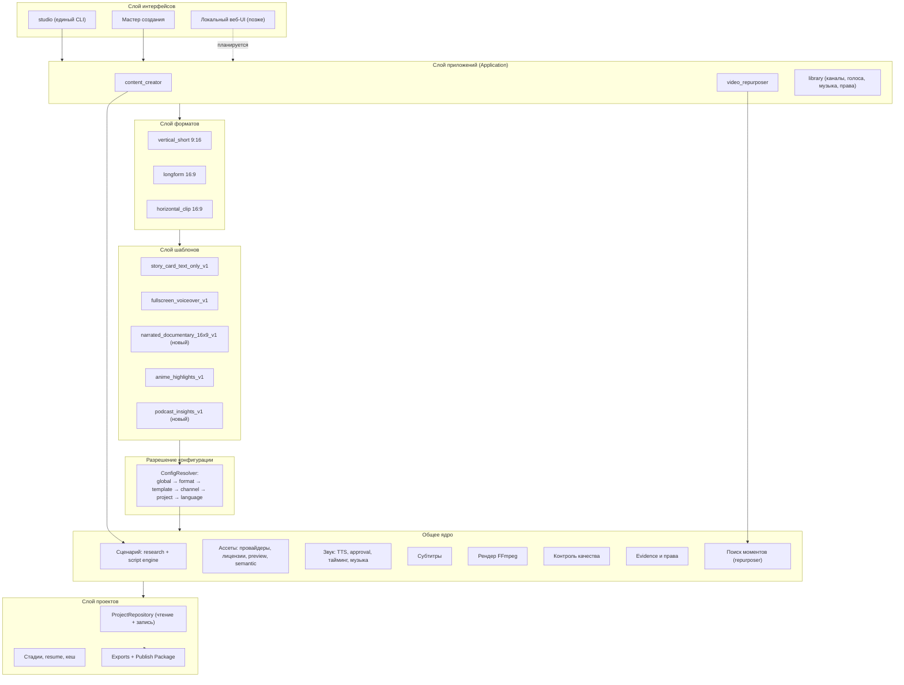

# Продуктовое видение и план до завершения проекта

Дата: 2026-07-25. Ветка `master`, HEAD `b9cdc8b`.
Метод: read-only чтение кода, конфигов, манифестов, тестов и документации.
Python-код не изменялся. Сеть, платные вызовы, downloads, Vision и TTS не выполнялись.
Git write-операции не выполнялись.

Маркировка: **ФАКТ** — проверено чтением кода/файлов. **ВЫВОД** — логическое следствие.
**РЕКОМЕНДАЦИЯ** — предложение. **НЕИЗВЕСТНО** — требует отдельной проверки.

---

## Раздел 1. Моя продуктовая модель

### Как я понял вашу цель

Вы хотите **локальную студию производства видео**, где вы работаете не как программист,
а как создатель контента: запускаете одну команду, выбираете из списков инструмент →
формат → шаблон → канал → источник материала, и получаете готовый ролик в понятной папке.

Технически ваша модель — это:

```
Инструмент (Application)
  → Формат (Format)
    → Шаблон (Template)
      → Канал (Channel)
        → Проект (Project)
          → Стадии (Stages)
            → Экспорты (Exports)
```

Три инструмента, которые вы назвали:

| Ваши слова | Технически | Формат | Шаблоны |
|---|---|---|---|
| «создание коротких видео» | `content_creator` | `vertical_short` | `story_card_text_only_v1`, `fullscreen_voiceover_v1`, дальше новые |
| «широкоформатные видео» | `content_creator` | `longform` | пока ни одного |
| «anime factory / нарезка» | `video_repurposer` | `vertical_short`, `horizontal_clip` | `anime_highlights_v1`, `podcast_insights_v1`, `stream_moments_v1`, ... |

**Модель понята правильно и уже отражена в коде** (`src/production_catalog/catalog.py`):
там зарегистрированы обе application (`content_creator` enabled, `video_repurposer`
enabled=False/planned), три формата и два шаблона.

### Что я бы добавил к вашей модели

Ваша схема описывает **что производится**. В ней не хватает трёх осей, без которых
нельзя ни добавлять шаблоны, ни строить UI:

**1. Источник материала (Input Source) — отдельная ось, а не свойство шаблона.**
Вы перечислили: тема, готовый промпт, готовая статья, ссылка на статью, вставленный
текст, локальное видео, стрим/подкаст. Сейчас это частично живёт в
`ContentCreationRequest.content_input_mode` (4 режима), но для `video_repurposer`
источник совсем другой (локальный файл/ссылка на длинное видео). Правильно:

```
Application → поддерживаемые Input Sources → Format → Template
```

**2. Профиль подачи (Presentation Profile) — то, чем канал реально отличается.**
Голос, стиль субтитров, музыкальная политика, шрифты, темп. Сейчас это разбросано
по `channel.json`, `channel_config.json`, `style.json`, `subtitle_style.json`,
`voices.yaml` и Python-константам, причём **часть из этого runtime не читает** (см. §3).

**3. Slot «Публикация» после Exports.**
Сейчас цепочка обрывается на MP4. Для вас конец — это «видео лежит в понятном месте,
описание и теги готовы, права подтверждены». `src/youtube_metadata.py` существует, но
к новому пути не подключён (**ФАКТ**: не импортируется ни `src/news/`, ни
`src/content_creation/`).

Итоговая модель, которую я рекомендую:

```
Application → Input Source → Format → Template → Channel(Presentation Profile)
    → Project → Stages → Exports → Publish Package
```

---

## Раздел 2. Что уже готово

Статусы: `production_ready` (работает, покрыто, использовано вживую) ·
`live_tested` (есть подтверждённый результат на диске) · `targeted_tested` (есть тесты,
живого прогона не было) · `mock_tested` · `partially_implemented` ·
`architecture_supported` (код есть, никто не вызывает) · `planned` · `legacy` · `broken`.

### 2.1 Ядро создания контента

| Функция | Модуль | Статус | В runtime | Тесты | Live | Ограничения |
|---|---|---|---|---|---|---|
| Каталог Application/Format/Template/Export | `src/production_catalog/` | production_ready | да | `test_production_catalog_foundation`, `test_capability_consistency` | да | read-only, редактируется только в Python |
| CLI создания контента | `src/content_creation/cli.py` | live_tested | да | `test_content_creation_cli` | да | 12 команд, флаговый |
| Интерактивный wizard | `src/content_creation/wizard.py` | live_tested | да | `test_content_creation_wizard` | да | нет Resume, нет имени проекта (см. §4) |
| Единый service-слой | `src/content_creation/service.py` | live_tested | да | `test_content_creation_service` | да | знает ровно 2 шаблона |
| Capabilities (честный список возможностей) | `src/content_creation/capabilities.py` | production_ready | да | `test_capability_consistency` | да | статусы шаблонов заданы вручную |
| Валидация ввода | `src/content_creation/input_validation.py` | production_ready | да | `test_input_validation` | да | — |

### 2.2 Пайплайн `fullscreen_voiceover_v1` (news_to_short)

| Функция | Модуль | Статус | В runtime | Тесты | Live | Ограничения |
|---|---|---|---|---|---|---|
| 12 стадий, resume, job.json | `src/news/pipeline.py`, `project_store.py` | live_tested | да | `test_news_to_short_pipeline` | да | своя project-система |
| Загрузка статьи по ссылке | `src/news/article_ingestor.py`, `article_parser.py` | targeted_tested | да | `test_news_to_short_*` | да | сеть; парсер простой |
| **Research (факты из статьи)** | `src/news/research_engine.py` | **partially_implemented** | да | да | да | **ФАКТ: это regex-разбиение на предложения + поиск слов «возможно/сообщ». Это не анализ, а нарезка.** |
| **Генерация сценария** | `src/news/script_generator.py` | **partially_implemented** | да | да | да | **ФАКТ: жёстко зашитые 6 сцен и 6 шаблонных фраз («Наблюдение выглядит простым, но за ним стоит важная деталь: …»). LLM не используется. Все ролики получаются одинаковыми по структуре и стилю.** |
| **Визуальный план (что показывать)** | `src/news/visual_plan.py` | **partially_implemented** | да | да | да | **ФАКТ: `make_stock_query` — 4 захардкоженных `if` (кит / учёные / океан / всё остальное). «Переключение картинки по смыслу» на входе не существует.** |
| Поиск ассетов, 7 провайдеров | `src/assets/`, `src/providers/` | production_ready | да | 8 тест-модулей | да | — |
| Лицензии, provenance, checksum, атрибуция | `license_policy.py`, `attribution_export.py`, `config/license_policy.json` | production_ready | да | да | да | — |
| Семантический выбор кадра | `src/assets/semantic_selection/` | targeted_tested | да | `test_semantic_asset_selection` | да | ранжирует то, что нашлось по слабому запросу |
| Visual preview + HTML review board | `src/assets/visual_preview.py` | targeted_tested | да | 2 модуля | частично | — |
| Semantic Vision (OpenAI) | `semantic_visual_openai.py`, `semantic_decision_policy.py` | mock_tested + shadow | опционально | 4 модуля | ограниченный live eval | по умолчанию shadow, платный |
| Временной анализ видео | `temporal_video_analysis.py` | targeted_tested | да | да | частично | — |
| Голос: реестр, политика, approval-гейт | `src/audio/voice_*.py`, `channels/*/voices.yaml` | production_ready | да | 7 модулей | да | платный TTS невозможен без `approval.json` на диске |
| Кеш озвучки по сценам | `narration_workflow.py` | production_ready | да | да | да | — |
| **Тайминг сцен по реальной озвучке** | `src/audio/scene_timeline.py` | targeted_tested | да | `test_scene_timeline` | **нет** | **сделано в этой сессии, живым рендером не проверено** |
| **Музыка + ducking** | `src/audio/music_manifest.py` + `final_renderer.py` | targeted_tested | да | `test_music_manifest` | **нет** | то же самое |
| Хвост ролика (end tail) | `src/audio/end_tail_policy.py` | targeted_tested | да | 2 модуля | нет | — |
| Субтитры (вжигание) | `src/news/subtitles.py` | mock_tested | да | да | да | **ФАКТ: тайминг арифметический — длительность сцены / число чанков по 5 слов. Не привязан к словам озвучки.** |
| Финальный рендер FFmpeg | `src/news/final_renderer.py` | live_tested | да | `test_news_to_short_renderer` | да | — |
| Quality check | `src/news/quality_check.py` | production_ready | да | да | да | — |
| **Экспорт под площадки** | `src/news/exporter.py` + `_copy_platform_outputs` | **partially_implemented** | да | да | да | **ФАКТ: youtube/instagram/facebook/stories — побайтные копии master MP4. Разных версий не создаётся.** |

### 2.3 Пайплайн `story_card_text_only_v1`

| Функция | Модуль | Статус | Ограничения |
|---|---|---|---|
| Renderer карточки, адаптивный layout | `src/production_plan/story_card_short_render.py` | live_tested | `final_test_v2.mp4` существует |
| Интеграция с проектом | `src/templates/story_card/integration.py` | live_tested | **provenance исходника не записывается** |
| Пресет | `config/render_presets/story_card_short_v1.json` | production_ready | один пресет |
| Звук/музыка | — | отсутствует | renderer всегда пишет `audio=False` |
| Источник видео | только `--source-asset <локальный файл>` | partially_implemented | поиск ассетов не подключён |

### 2.4 Проекты, права, каналы

| Функция | Модуль | Статус | Ограничения |
|---|---|---|---|
| `project.json` (ProjectFactory) | `src/project_foundation/projects.py` | targeted_tested | 1 живой проект |
| `job.json` (NewsProjectStore) | `src/news/project_store.py` | live_tested | 20 живых проектов |
| Общий read-only слой над обеими | `src/projects/repository.py` | targeted_tested | только чтение |
| Единый отчёт о правах | `src/projects/rights.py` | targeted_tested | 35 тестов; story-card даёт пусто |
| EvidenceBundle | `src/project_foundation/evidence.py` | **architecture_supported** | **ФАКТ: `add()`/`save()` не вызывает ни один production-код** |
| ChannelProfile (`channel.json`) | `src/project_foundation/channels.py` | targeted_tested | 1 канал (`nature_pulse`) |
| Channel output policy | `policies.py` | targeted_tested | — |
| **`channels/*/subtitle_style.json`** | — | **architecture_supported** | **ФАКТ: читается только `src/channel_loader.py` (legacy). Новый subtitle-renderer его не открывает.** |
| **`channel_config.json → languages.<lang>.voice`** | — | **architecture_supported** | **ФАКТ: слово `languages` не встречается ни в `src/news/`, ни в `src/audio/`. Конфиг мёртвый.** |

### 2.5 Video Repurposer (anime_factory)

| Функция | Модуль | Статус | Ограничения |
|---|---|---|---|
| Пайплайн нарезки | `anime_factory/pipeline.py` (220 строк) | live_tested standalone | `episodes/episode_001` существует |
| Транскрибация (faster-whisper) | `modules/transcribe.py` | production_ready | локальная модель |
| Аудио-фичи, scene detection | `analyze_audio.py`, `detect_scenes.py` | production_ready | универсальны |
| **Скоринг моментов** | `modules/score_candidates.py` | production_ready | **9 весов в одной формуле, зашиты в код; `emotional_words` — в `config.yaml`** |
| Уточнение границ | `refine_boundaries.py` | production_ready | универсально |
| Динамический кроп по лицам | `dynamic_crop.py`, `detect_faces.py` | production_ready | **`detector_backend: anime` — специфично** |
| Рендер клипов, субтитры, превью, HTML-отчёт | `render_clips.py`, `subtitles.py`, `preview.py`, `report.py` | production_ready | своё хранилище `episodes/` |
| Связь с каталогом/wizard/проектами | — | **отсутствует** | своя вселенная |

### 2.6 Legacy и мёртвый код

| Что | Статус | Комментарий |
|---|---|---|
| `pipeline.py` (89 флагов) | legacy + обслуживание | **ФАКТ**: не импортирует `content_creation` |
| Каналы `quotes`, `psychology`, `survival`, `size_comparison` | legacy | другая схема, создание контента их не использует |
| `legacy/` (8 скриптов) | legacy | standalone |
| `src/image_tools.py`, `src/music_tools.py`, `src/thumbnail_engine.py` | **мёртвый код** | **ФАКТ: 0 импортов во всём репозитории** |
| `apps/youtube_pipeline/main.py`, `apps/anime_factory/main.py` | обёртки-заглушки | по 9 строк, вызывают чужой `main()` |
| `packages/` | planned | только README |
| `subtitles/` в корне | пустая | — |
| Корневые `PROJECT_AUDIT*.md`/`IMPLEMENTATION_PROVIDER_FOUNDATION_*` | документация | **сделано в Stage S1-Light**: перемещены в `docs/audits/` и `docs/implementation/provider_foundation/` (`git mv`, история сохранена) |

---

## Раздел 3. Чего не хватает

### Приоритет 1 — мешает пользоваться приложением

**3.1 Нет продолжения работы (Resume) в понятном виде.**
`--resume --project-id <id>` существует, но wizard его не предлагает, а `project list`
показывает id вида `почему_кошка_иногда_смотрит_в_пустой_угол_20260724T151947`.
Незавершённый проект практически невозможно найти и добить.

**3.2 Названия проектов нечитаемы.**
**ФАКТ:** `NewsJob.create` строит id как `slugify(topic or input_text[:80]) + timestamp`.
Отсюда папка `wizard_установил_questionary_единственная_подходящая_библиотека__20260724T210156` —
это первые слова вставленного текста. Отдельного «названия ролика» в модели нет.

**3.3 Нет одного места, где лежат готовые видео.**
Итог живёт в `projects/<длинный_id>/localizations/ru/output/`. `outputs/` в корне — это
мусор старого пайплайна. Создателю контента нужна одна папка «Готово».

**3.4 Пять точек входа вместо одной.**
`pipeline.py`, `src/content_creation/cli`, `src/project_foundation/cli`,
`anime_factory/pipeline.py`, `apps/*/main.py`. Нет команды, с которой начинают.

### Приоритет 2 — мешает качеству видео

**3.5 Сценарий не пишется, а собирается из 6 шаблонных фраз. Это главный продуктовый пробел.**
Любая тема превращается в одну и ту же структуру с подставленными предложениями из
статьи. Ваша формулировка «создание по смыслу» на этом уровне не реализована вообще.

**3.6 Видеоряд подбирается по 4 захардкоженным запросам.**
Весь дорогой слой (7 провайдеров, preview, Vision, temporal) ранжирует кандидатов,
которые пришли по запросу `"nature science wildlife observation"`. Смена картинки
привязана к сцене сценария, а сцен всегда ровно 6 фиксированной длины.

**3.7 Субтитры не синхронизированы со словами.** Арифметическая нарезка по 5 слов.

**3.8 Новый тайминг сцен и музыка не проверены живым рендером.**

**3.9 Экспорты — копии.** Для TikTok/Stories нужны как минимум разные длительности и
безопасные зоны, иначе смысла в 5 файлах нет.

### Приоритет 3 — мешает добавлять шаблоны

**3.10 Нет разрешения конфигурации.** Каналы читаются тремя несовместимыми способами
(`ChannelRegistry`, `_load_channel_voice_config`, `channel_loader`). Каждый новый шаблон
будет искать голос и стиль заново.

**3.11 Каталог шаблонов — Python-код.** Добавить шаблон = править `catalog.py`,
`capabilities.py` (три `if template_id == ...`), `service.py`, wizard.

**3.12 Video Repurposer не является приложением.** Его нельзя выбрать в wizard.

**3.13 Longform: формат зарегистрирован, шаблонов нет.**

### Приоритет 4 — мешает будущему UI

**3.14 Нет запуска в фоне и прогресса.** `create_content` — синхронный вызов с
`progress_callback` в stdout. Веб-UI не сможет показать «идёт рендер».

**3.15 Нет записи в проект из общего слоя.** `src/projects/` только читает.

**3.16 Две project-системы.** Любой UI придётся писать дважды.

---

## Раздел 4. Wizard gap analysis

### Что уже есть и работает хорошо

- Выбор формата → шаблона → канала → языка со стрелками (`questionary`), с ASCII-fallback.
- **Формат показывается только если у него есть хотя бы один включённый шаблон** — тупика нет.
- Каналы фильтруются по шаблону: legacy-каналы не предлагаются.
- Вопросы зависят от шаблона: для story card не спрашивается источник сценария, для него
  же скрыты голос/субтитры/музыка.
- Итоговая сводка + меню редактирования любого пункта + «Начать заново».
- **Отдельно показываются «Сетевые действия» и «Платные действия»** — до запуска.
- Двухфазный платный гейт: сначала бесплатно готовится сценарий, показывается
  длительность/слова/символы/ожидаемые credits/состояние кеша, и только потом
  подтверждение ElevenLabs.
- Живой прогресс по стадиям и восстановление после сетевых ошибок (повторить / сменить
  источник / перейти на тему).
- Галочка «выполнено» ставится только если аудио реально появилось на диске.

Это заметно лучше среднего CLI. Основные проблемы — не в оформлении, а в охвате.

### Чего нет

| Не хватает | Почему это важно |
|---|---|
| Выбора инструмента (Application) первым шагом | Ваша модель начинается с «какой инструмент», а wizard — сразу с формата |
| Названия ролика | Отсюда мусорные папки |
| «Продолжить проект» | Незавершённые проекты теряются |
| Списка проектов и статуса | Нельзя понять, что происходит, не выходя в другую команду |
| Повтора одной стадии | При падении рендера приходится вспоминать `run-stage` |
| Выбора длительности для story card | Сейчас всегда из пресета |
| Выбора источника видео для story card (поиск, а не только локальный файл) | Ограничивает шаблон |
| Предпросмотра до платной генерации (кадр/раскадровка) | Есть только текстовая сводка |
| Показа прав и предупреждения о лицензии в конце | Отчёт есть, но wizard о нём не говорит |
| Повторного использования настроек прошлого проекта («как в прошлый раз») | Каждый запуск — 11 вопросов заново |

### Что показывается зря

| Шаг | Что не так |
|---|---|
| «Язык» | **ФАКТ**: реально работает только `ru`. Английский/испанский выбираются, но `languages.*.voice` runtime не читает — получится русский голос на английском тексте |
| Субтитры: `documentary` | Название обещает стиль, а это единственная реализация с арифметическим таймингом |
| Музыка: `local_file` | Честно, но путь к файлу нужно вводить руками каждый раз — нет библиотеки треков |
| `Timing` в сводке | Не вопрос, а значение политики; в сводке выглядит как настройка |
| «Dry-run» обычному пользователю | Понятие разработчика; лучше «Проверить без создания файлов» |

### Что должно определяться автоматически

- Канал → голос по умолчанию (сейчас всегда спрашивается).
- Шаблон → стиль субтитров по умолчанию (список из одного пункта — это не выбор).
- Длительность → из политики канала (`target_duration_sec` уже есть в `channel_config.json`, но wizard спрашивает заново).
- Экспорт-цели → из канала (`export_targets` есть в `channel.json`, не спрашиваются и не применяются).

**РЕКОМЕНДАЦИЯ по целевому flow:**

```
1. Что делаем?        [Создать видео] [Нарезать из готового] [Открыть проекты] [Настройки]
2. Формат             [Короткое 9:16] [Широкое 16:9]
3. Шаблон             (с описанием и статусом)
4. Канал              (голос/стиль/длительность подтягиваются)
5. Название ролика    (предлагается автоматически, можно изменить)
6. Источник           (зависит от шаблона)
7. --- всё остальное берётся из канала и шаблона ---
8. Сводка + «Изменить озвучку / музыку / субтитры» для тех, кому надо
9. Платный гейт с цифрами
10. Готово: путь к файлу, длительность, права, что дальше
```

---

## Раздел 5. Архитектура шаблонов: что где должно жить

Принцип: **шаблон описывается данными, но исполняется кодом.** Никакого
declarative-фреймворка — только 5 уровней с ясным приоритетом.

### Уровни (приоритет снизу вверх)

```
global defaults          config/defaults.json
  → format policy        каталог форматов (разрешение, aspect, safe zones)
    → template policy    политика шаблона (голос, субтитры, тайминг, музыка)
      → channel defaults channel.json (голос, стиль, длительность, экспорты)
        → project override  сохранённые ответы wizard
          → localization override  язык проекта
```

### Что чем описывается

| Параметр | Где | Почему |
|---|---|---|
| Как рендерится кадр, где текст, как считать layout | **Python** | Это алгоритм, не настройка |
| Порядок стадий пайплайна | **Python** | Требует кода на каждой стадии |
| Алгоритм скоринга моментов (repurposer) | **Python** (класс политики) | Формула, а не число |
| Нужна ли озвучка, обязательны ли субтитры, откуда берётся тайминг | **template policy** | Уже есть: `voice_policy.AUDIO_POLICY_DEFAULTS` |
| Разрешение, fps, aspect, safe zones | **format policy** | Общее для всех шаблонов формата |
| Веса скоринга, пороги, длительности клипов | **template policy** (JSON) | Настраивается без кода |
| Голос по умолчанию, стиль субтитров, шрифты, музыкальная политика, экспорт-цели, длительность | **channel** | Это и есть «лицо канала» |
| Тема, текст, конкретный голос, конкретная музыка, название | **project** | Разовый выбор |
| Голос и локаль под язык | **localization** | `languages.<lang>.voice` — уже описано, надо подключить |

### Правило добавления шаблона

Добавление шаблона должно требовать ровно трёх вещей:
1. запись в каталоге (что это, какой формат, что умеет);
2. файл политики шаблона (JSON);
3. одна функция-workflow, которую вызывает `service.create_content`.

Сейчас требуется ещё правка трёх `if template_id == "fullscreen_voiceover_v1"` в
`capabilities.py` — это надо убрать в политику при первом же новом шаблоне.

---

## Раздел 6. Video Repurposer

### Что переиспользуется как есть (общее ядро)

```
источник → извлечение аудио → транскрибация → аудио-фичи → детект сцен
    → окна-кандидаты → СКОРИНГ → выбор без пересечений → уточнение границ
    → кроп/реframe → субтитры → рендер → превью → отчёт
```

Универсальны и не требуют переписывания: `extract_audio`, `transcribe`,
`analyze_audio`, `detect_scenes`, `refine_boundaries`, `render_clips`, `subtitles`,
`preview`, `report`, `ffmpeg_utils`, механизм скользящего окна и подавления пересечений
в `find_candidates`.

### Что специфично для аниме

| Что | Где | Насколько специфично |
|---|---|---|
| Список эмоциональных слов | `config.yaml` | Полностью — для подкаста нужны маркеры «главное/вывод/на самом деле» |
| Веса скоринга (эмоции 0.16, аудио-пик 0.16, hook 0.10, payoff 0.14) | `score_candidates.py`, зашиты | Полностью — у подкаста вес смысла выше, у стрима вес аудио-пика выше |
| Штраф за местоимение в начале | `_context_score` | Общее, но для подкаста должно быть жёстче |
| `detector_backend: anime`, `anime_min_area_ratio` | `dynamic_crop.py`, `config.yaml` | Полностью — у подкаста говорящие головы, у стрима игровой оверлей |
| Длительность 20–45 с, цель 32 с | `config.yaml` | Настройка |

**ВЫВОД: разделение проходит ровно по одной границе — «политика выбора момента».**
Это очень хороший знак: архитектура уже почти правильная, ей не хватает точки расширения.

### Предлагаемый контракт

```python
@dataclass
class MomentCandidate:      # что нашли
    start: float; end: float; text: str
    score: float; score_breakdown: dict; reasons: list[str]

class SelectionPolicy:      # чем шаблоны отличаются
    keyword_sets: dict[str, list[str]]   # эмоции / выводы / реакции
    weights: dict[str, float]
    duration: tuple[float, float, float] # min, target, max
    crop_profile: str                    # anime | talking_head | gameplay | static
    require_self_contained: bool

class RepurposeTemplate:
    template_id: str
    policy: SelectionPolicy
    def score(self, window, audio, scenes) -> MomentCandidate | None
```

`anime_highlights_v1` = текущая формула, вынесенная в политику без единого изменения
чисел. Существующие тесты (`test_anime_factory_*`, 7 модулей) должны остаться зелёными
без правок — это и есть критерий корректности рефакторинга.

### Какой шаблон подключать первым

**РЕКОМЕНДАЦИЯ: `podcast_insights_v1`.**

Почему не аниме и не стрим:
- **проверяет абстракцию по-настоящему**: подкаст противоположен аниме (важен смысл, а
  не аудио-пик; кроп — говорящая голова, а не движущееся лицо);
- **не требует новых зависимостей**: транскрипт уже есть, лица не нужны, достаточно
  `crop_profile: talking_head` или вообще центрального кропа;
- **юридически самый безопасный** для отладки: можно взять собственную запись или
  свободный подкаст, тогда как аниме и фильмы — чужой контент;
- **быстрее всех даёт вам полезный результат**: короткие клипы с законченной мыслью — это
  формат, который реально смотрят.

Аниме останется рабочим всё это время (`anime_highlights_v1` — та же формула).

### Порядок подключения

1. Вынести политику из `score_candidates.py`, не меняя чисел. Тесты — те же.
2. Добавить `podcast_insights_v1` с собственными весами и словарями.
3. Зарегистрировать `video_repurposer` в каталоге (`enabled=True`) вместе с этими двумя шаблонами.
4. Подключить к wizard как второй инструмент.
5. Перевести `episodes/` на общее хранилище проектов — **последним**, отдельным этапом,
   после того как всё остальное работает.

---

## Раздел 7. Longform

### Минимальная общая основа

Формат `longform` (1920×1080) уже зарегистрирован с `enabled=False`, и правило в
`tests/test_capability_consistency.py` требует включать формат только вместе с рабочим
шаблоном — это правильно, оставить как есть.

Что придётся сделать общим (и это и есть ценность этапа):

| Что | Сейчас | Нужно |
|---|---|---|
| Разрешение/aspect | зашито 1080×1920 в `visual_plan.py`, пресетах, exporter | брать из format policy |
| Структура сценария | ровно 6 сцен фиксированной длины | секции произвольной длины |
| Тайминг | посценный | посекционный, с паузами между блоками |
| Субтитры | нижняя зона 9:16 | safe zone из формата |
| Экспорт | 5 копий вертикали | один горизонтальный master |
| Обложка | не создаётся | нужна (для longform критична) |

### Первый шаблон

**РЕКОМЕНДАЦИЯ: `narrated_documentary_16x9_v1`** — то же, что `fullscreen_voiceover_v1`,
но горизонтально и длиннее (5–10 минут, 4–8 секций).

Почему именно он лучше всего проверит архитектуру:
- переиспользует **весь** зрелый путь: research → script → visual plan → assets → voice →
  subtitles → quality → render → export;
- ломается ровно там, где зашита вертикаль, — то есть находит все места, где формат не
  является параметром (это и нужно выявить);
- не требует новых алгоритмов — только вынесение констант;
- даёт вам сразу второй тип контента на тех же каналах.

Чего **не** делать сразу: компиляции, многоголосые диалоги, главы/чаптеры, монтаж
из нарезок. Один шаблон.

---

## Раздел 8. Целевая архитектура



### Целевая структура папок

Разделение простое: **код отдельно, работа человека отдельно.**

```text
G:\Projects\AI-YouTube\
│
├─ studio.cmd                  ← двойной клик — открывается мастер
├─ README.md
│
├─ workspace\                  ← ВСЁ, что принадлежит вам
│   ├─ projects\               ← проекты, сгруппированные по каналам
│   │   └─ nature_science\
│   │       └─ 2026-07-25_pochemu-vorony-zapominayut-lica\
│   │           ├─ project.json           ← «паспорт» проекта
│   │           ├─ 01_source\             ← исходные материалы
│   │           ├─ 02_script\             ← сценарий
│   │           ├─ 03_visuals\            ← подобранные кадры
│   │           ├─ 04_voice\              ← озвучка
│   │           ├─ 05_render\             ← промежуточный рендер
│   │           ├─ exports\               ← готовые файлы
│   │           ├─ rights\                ← лицензии и источники
│   │           └─ logs\
│   ├─ ready\                  ← ГОТОВЫЕ ВИДЕО, все в одном месте
│   ├─ media\                  ← ваша библиотека
│   │   ├─ video\  music\  images\  voice\
│   └─ sources\                ← длинные видео для нарезки
│
├─ channels\                   ← настройки каналов (голос, стиль, экспорты)
│   └─ nature_science\
│       ├─ channel.json
│       ├─ voices.yaml
│       └─ style.json
│
├─ config\                     ← глобальные настройки и пресеты
├─ src\                        ← код
├─ tests\
├─ docs\
└─ archive\                    ← старое, но не удалённое
    ├─ legacy_pipeline\
    └─ old_outputs\
```

### Что переименовать

| Сейчас | Стало | Почему |
|---|---|---|
| `anime_factory/` | `src/repurposer/` + `workspace/sources/` | Приложение шире аниме |
| `episodes/episode_001/` | `workspace/projects/<канал>/<дата>_<название>/` | Одно хранилище проектов |
| `projects/почему_кошка_..._20260724T151947/` | `workspace/projects/nature_science/2026-07-24_pochemu-koshka/` | Читаемо и сортируется |
| `outputs/` (корень) | `archive/old_outputs/` | Мусор старого пайплайна |
| `localizations/ru/output/` | `exports/ru/` | «output» внутри «outputs» путает |
| `pipeline.py` | `src/maintenance/cli.py` | Это не главный вход |
| `src/content_creation/cli.py` | `studio` | Один вход |
| `content/`, `manual_assets/`, `music/`, `assets/` | `workspace/media/` | Четыре папки для одного |

**Важно:** это цель, а не немедленное действие. Порядок безопасной миграции — в §9 (этапы S1–S3).

### Целевой CLI

```bash
studio                     # мастер (то же, что studio new)
studio new                 # создать ролик
studio continue            # список незавершённых → продолжить
studio clips               # нарезка из длинного видео
studio projects            # список / статус / права / открыть папку
studio channels            # каналы, голоса, стили
studio check <project>     # права + готовность к публикации
```

### Слой UI (позже)

**РЕКОМЕНДАЦИЯ:** локальный веб-UI (открывается в браузере), а не десктоп-приложение —
работа обзорная: списки проектов, таблицы сцен, превью видео, замена кадров, прослушивание
голоса. Это совпадает с уже записанной рекомендацией в `docs/architecture/TARGET_ARCHITECTURE.md`.

Условия, без которых UI начинать нельзя:
1. единый service-слой с записью (не только чтение);
2. запуск задач в фоне с прогрессом;
3. один ProjectRepository для обеих project-систем;
4. ConfigResolver (иначе UI покажет одни настройки, а рендер применит другие).

Экраны первой версии: Главная (инструменты) → Новый ролик → Проекты → Проект (стадии,
превью, права) → Кадры (уже есть готовый `visual_review_board.html` — его можно встроить
почти без работы) → Голос → Каналы.

---

## Раздел 9. План этапов

Обозначения: **Р** — результат для вас, **З** — зависит от.

---

### Блок V — проверка того, что уже построено

**V1. Живая проверка тайминга сцен и музыки**
Цель: убедиться, что новый `scene_timeline` и микс музыки реально работают в FFmpeg.
**Р:** подтверждение, что кадры не кончаются раньше голоса и музыка слышна.
Модули: `src/audio/scene_timeline.py`, `music_manifest.py`, `src/news/final_renderer.py`.
Файлы: копия готового проекта + отчёт.
Нельзя: трогать оригинал проекта, запускать TTS, скачивать ассеты.
Риск: расхождение длительностей всплывёт только здесь — это и есть смысл этапа.
Тесты: `ffprobe`-сравнение длительностей голоса/видео/субтитров/итога.
Приёмка: MP4 открывается, рассинхрон < 0.3 с, музыка приглушается под голосом.
**З:** нет.

---

### Блок C — права

**C3. Provenance для Story Card**
Цель: story-card проект записывает, что за файл использован и на каких правах.
**Р:** `project rights-report` перестаёт быть пустым для новых story-card проектов.
Модули: `src/templates/story_card/integration.py`, `src/project_foundation/evidence.py`,
`src/projects/rights.py`.
Нельзя: новый формат хранения, новый provider contract, изменение старых проектов.
Риск: соблазн пометить локальный файл как «лицензированный» — нельзя, только
`user_supplied` / `review_required`.
Тесты: 12–14 targeted (см. брифы).
Приёмка: checksum совпадает с файлом, отданным в renderer; user-supplied никогда не `verified`.
**З:** нет.

---

### Блок B — удобство

**B3. Название проекта, читаемые папки, Resume**
Цель: у ролика есть человеческое название; папка называется по нему; незавершённый
проект можно продолжить из мастера.
**Р:** `workspace`-совместимые имена вида `2026-07-25_pochemu-vorony`, пункт
«Продолжить проект» с показом последней стадии.
Модули: `src/news/models.py` (`NewsJob.create`), `src/project_foundation/projects.py`,
`src/content_creation/{wizard,cli,models}.py`, `src/projects/repository.py`.
Нельзя: переименовывать существующие проекты, ломать `--resume --project-id`.
Риск: id используется как имя папки — новое имя не должно нарушать resume старых.
Тесты: старые id читаются; новый id читаем и уникален; resume продолжает тот же проект;
повторная платная генерация не запускается при валидном кеше.
Приёмка: новый проект получает читаемое имя; старые продолжают открываться.
**З:** нет (но приятнее после V1).

---

### Блок Q — качество продукта (главный блок)

**Q1. Движок сценария: смысл вместо шаблона**
Цель: заменить 6 захардкоженных фраз на настоящий сценарий; количество и длительность
сцен определяются смыслом, а не таблицей `[3.5, 7.0, 10.0, 13.0, 10.0, 8.0]`.
**Р:** ролики перестают быть одинаковыми.
Устройство: интерфейс `ScriptEngine` с двумя реализациями — существующая шаблонная
(бесплатная, остаётся по умолчанию) и LLM-реализация (только по явному подтверждению,
как сейчас у ElevenLabs). Каждая сцена = одна законченная мысль + описание того, что
показывать.
Модули: `src/news/script_generator.py`, `research_engine.py`, новый
`src/content/script_engine/`.
Нельзя: платные вызовы без подтверждения; ломать `script.json` (схема расширяется,
не заменяется); трогать voice/render.
Риск: платный API; решается тем же approval-гейтом, что уже работает для TTS.
Тесты: шаблонный движок даёт тот же результат, что сейчас; LLM-движок тестируется
только на замоканном ответе; схема `script.json` обратно совместима.
Приёмка: у сцен разная длительность; сцен столько, сколько мыслей; старые проекты
резюмируются.
**З:** V1 (иначе новый тайминг проверяется вслепую).

**Q2. Визуальный план по смыслу**
Цель: запрос к провайдерам строится из смысла сцены, а не из четырёх `if`.
**Р:** картинка меняется вместе с мыслью и соответствует ей.
Модули: `src/news/visual_plan.py`, `src/assets/semantic_selection/`.
Нельзя: новые провайдеры, изменение license policy.
Риск: качество запроса — единственный рычаг; проверяется на существующих проектах в
режиме сравнения (что нашлось бы старым и новым запросом), без скачиваний.
Приёмка: для 5 существующих сценариев новые запросы содержательно различаются.
**З:** Q1.
**СДЕЛАНО** — `src/content/visual_planning/`, план подаётся в существующий поиск
через блок `semantic`, ни один провайдер не переписан. Подробности и осознанные
отклонения (язык запросов, отсутствие LLM-планировщика) — в
`AUTONOMOUS_PROGRESS.md`, раздел «Stage Q2».

**Q3. Субтитры по словам**
Цель: тайминг из реальной озвучки, а не арифметический.
**Р:** субтитры совпадают с голосом.
Модули: `src/news/subtitles.py`, `src/audio/scene_timeline.py`.
**З:** V1.

---

### Блок D — конфигурация

**D1. Единый ConfigResolver**
Цель: одно место, которое отвечает на вопрос «какой голос/стиль/длительность здесь».
**Р:** мастер, CLI и рендер используют одни и те же настройки; видно, откуда взято.
Модули: новый `src/config_resolver/`, поверх `ChannelRegistry`,
`_load_channel_voice_config`, `voice_policy`, каталога.
Нельзя: третья конфигурационная система; изменение файлов каналов; удаление старых читателей.
Риск: тихое изменение поведения — обязателен тест «resolver возвращает ровно то, что
возвращают текущие читатели».
Приёмка: `resolved_value + resolved_from` для каждого параметра.
**З:** B3.

**D2 + E2. Голоса по языкам и стили субтитров канала**
Цель: включить то, что уже описано в конфигах, но не читается.
**Р:** канал реально управляет подачей; английская версия говорит английским голосом.
Модули: `channels/*/channel_config.json` (`languages.*.voice`),
`channels/*/subtitle_style.json`, `src/news/{voice_adapter,subtitles}.py`.
**З:** D1.

---

### Блок F — новые шаблоны

**F1. Первый longform-шаблон `narrated_documentary_16x9_v1`**
**З:** Q1, Q3, D1.

**F2. Video Repurposer: политика выбора + `podcast_insights_v1`**
**З:** нет жёсткой (можно раньше F1, если захотите нарезки быстрее).

---

### Блок S — структура и имена

**S1. Безопасная чистка (без переносов)**
Удалить мёртвый код с 0 импортов (`src/image_tools.py`, `src/music_tools.py`,
`src/thumbnail_engine.py`), перенести 11 корневых `*_AUDIT*.md` / `IMPLEMENTATION_*` в
`docs/audits/`, убрать пустой `subtitles/`, `__pycache__`. Ничего рабочего не двигать.
Риск: минимальный. **З:** нет (можно в любой момент).

**S2. `workspace/` и человеческие пути**
Ввести `workspace/` с симлинками/копиями и папкой `workspace/ready/`, куда попадают
готовые видео. Старые пути продолжают работать через адаптер.
**З:** B3, D1.

**S3. Единый вход `studio` + `studio.cmd`**
**З:** B3.

---

### Блок U — интерфейс

**U1. Service API + фоновые задачи**
**U2. Локальный веб-UI: главная, новый ролик, проекты, проект, кадры**
**З:** D1, S3, U1.

### Рекомендуемый порядок

```
V1 → C3 → B3 → Q1 → Q2 → D1 → D2+E2 → Q3 → S1(в любой момент) →
F2(repurposer) → F1(longform) → S2 → S3 → U1 → U2
```

---

## Раздел 10. Шесть следующих брифов

Из восьми предложенных вариантов выбраны шесть. **Не вошли:** первый longform-шаблон
(F1 — зависит от Q1/D1, раньше времени затянет в него все нерешённые проблемы Shorts) и
Video Repurposer adapter (F2 — ценный, но не блокирует ничего; ставится сразу после этих
шести). **Добавлен:** движок сценария (бриф 4) — это главный продуктовый пробел, которого
не было в исходном плане.

---

### Бриф 1 — V1. Живая проверка тайминга сцен и музыки

**Задача.** Подтвердить настоящим FFmpeg-рендером, что `scene_timeline` и микс музыки
работают. Взять **копию** завершённого fullscreen-проекта, использовать существующий
`narration.wav`, применить новый таймлайн, пересобрать субтитры, отрендерить MP4.

**Границы.** Без TTS, без сети, без скачиваний, без Vision. Оригинальный проект не
изменяется (проверяется сравнением mtime и списка файлов до/после). Музыка — только
локальный безопасный fixture; если такого нет, честно сообщить и проверить остальное.

**Проверить через ffprobe:** длительность голоса ↔ визуала ↔ субтитров ↔ итога; наличие
аудиодорожки; разрешение и fps; конец ролика не обрывает фразу; при наличии музыки —
слышна и приглушается под голосом.

**Приёмка.** MP4 воспроизводится; рассинхрон < 0.3 с; отчёт с цифрами; оригинал не тронут;
запись в `AUTONOMOUS_PROGRESS.md`. Если найден дефект — **не чинить в этом же этапе**,
зафиксировать и остановиться.

---

### Бриф 2 — C3. Provenance для Story Card

**Задача.** Новые проекты `story_card_text_only_v1` должны сохранять структурированные
сведения о реально использованном визуальном материале через существующий
`EvidenceBundle`/`EvidenceRecord`.

**Сначала установить фактический путь:** `ContentCreationRequest` → `service._create_story_card`
→ `ProjectFactory` → `prepare_story_card_render` → `render_story_card_short` → outputs.
Определить по коду, откуда приходит asset (сейчас — только `--source-asset`, локальный файл).

**Правила.**
- Локальный файл: `provider=user_supplied`, `rights_status=unknown`,
  `verification_status=review_required`. Никогда не `verified`.
- Provider-ассет (если появится): сохранить provider/asset_id/source_page/author/license/
  checksum/policy без потерь.
- Не выдумывать URL, авторов и лицензии. Отсутствие данных — явное.
- Checksum считается для файла, **фактически переданного renderer**.

**Где хранить.** Только `evidence/evidence_manifest.json` через `EvidenceBundle`.
Если полей не хватает — минимальное обратно совместимое расширение с `schema_version`.
Никакого `story_card_rights.json`.

**Тесты (targeted, tempfile + mocks):** локальный файл → запись создана; SHA-256 совпадает;
статус не `verified`; mock provider-ассет сохраняет всё; путь в evidence = путь в renderer;
подмена ассета → evidence финального файла; отсутствующий файл → понятная ошибка; старый
проект без evidence читается; `rights-report` видит запись; пользовательский файл не
изменяется; существующие story-card тесты и news rights-report регрессия зелёные.

**Границы.** Без сети, downloads, Vision, TTS. Не мигрировать старые проекты. Не менять
renderer и fullscreen workflow.

---

### Бриф 3 — B3. Название проекта, читаемые папки, Resume

**Задача.** Три связанные вещи:
1. У ролика появляется поле «название», которое спрашивается в мастере (с автоматическим
   предложением) и попадает в манифест.
2. Идентификатор/имя папки строится из названия, а не из первых 80 символов текста:
   `2026-07-25_pochemu-vorony-zapominayut-lica`. Транслитерация кириллицы, ограничение
   длины, суффикс уникальности при совпадении.
3. В мастере появляются пункты «Продолжить проект» и «Посмотреть статус» с показом
   последней завершённой стадии; продолжение работает с тем же `project_id`; повторная
   платная генерация не запускается, если аудио готово и кеш валиден.

**Модули.** `src/news/models.py` (`NewsJob.create`, `slugify`),
`src/project_foundation/projects.py` (`generate_project_id`, `_slugify` — сейчас
выбрасывает кириллицу целиком и даёт `project-61958823`),
`src/content_creation/{wizard,cli,models}.py`, `src/projects/repository.py`.

**Границы.** Существующие проекты не переименовываются и продолжают открываться.
`--resume --project-id` сохраняется. Никакой миграции. Структура папок внутри проекта
не меняется (это отдельный этап S2).

**Тесты.** Старые id читаются; новые id читаемы, уникальны, безопасны для Windows
(длина, запрещённые символы); resume продолжает тот же проект; список незавершённых
проектов сортируется по дате; кеш озвучки не сбрасывается.

**Приёмка.** Новый проект в `projects/` имеет понятное имя; в мастере первым экраном
можно продолжить незавершённый проект.

---

### Бриф 4 — Q1. Движок сценария: смысл вместо шаблона (новый)

**Контекст.** `src/news/script_generator.py` собирает любой ролик из шести
захардкоженных фраз и таблицы длительностей `[3.5, 7.0, 10.0, 13.0, 10.0, 8.0]`.
`research_engine.py` — regex-разбиение на предложения. Это делает все ролики
одинаковыми и обесценивает весь остальной пайплайн.

**Задача.** Ввести интерфейс `ScriptEngine` и две реализации:
- `TemplateScriptEngine` — текущий код без изменений, остаётся по умолчанию (бесплатно,
  работает офлайн);
- `LLMScriptEngine` — вызов модели, **только по явному подтверждению**, по тому же
  approval-паттерну, что уже работает для ElevenLabs (бесплатная сводка → цифры →
  подтверждение → вызов).

Каждая сцена = одна законченная мысль: свой текст, своя длительность, своё описание
того, что показывать. Число сцен определяется содержанием, а не константой.

**Границы.** Схема `script.json` расширяется, не заменяется — старые проекты
резюмируются. Не трогать voice/subtitles/render/assets. Никаких платных вызовов в
тестах. Не менять `.env`. Выбор движка — параметр, а не глобальная замена.

**Тесты.** Шаблонный движок выдаёт байт-в-байт то же, что сейчас; LLM-движок — только
на замоканном ответе; невалидный ответ модели → понятная ошибка и откат на шаблонный;
`script.json` старой схемы читается; сцены с разной длительностью корректно проходят
`scene_timeline`.

**Приёмка.** По умолчанию поведение не изменилось; при явном включении LLM получается
сценарий с переменным числом сцен; ни одного платного вызова без подтверждения.

---

### Бриф 5 — D1. Единый ConfigResolver

**Задача.** Один модуль, отвечающий на вопрос «какое значение параметра действует здесь»
с приоритетом:

```
global defaults → format policy → template policy → channel defaults
    → project override → localization override
```

Возвращает не только значение, но и источник:

```
voice_profile = ru_dom        resolved_from = channel_default
subtitle_style = documentary  resolved_from = template_policy
target_duration_sec = 55      resolved_from = channel_config
```

**Что читает (не заменяет).** `ChannelRegistry` (`channel.json`),
`_load_channel_voice_config` / `_load_channel_workflow_config` (`channel_config.json`),
`voice_policy.AUDIO_POLICY_DEFAULTS`, каталог форматов/шаблонов, `channel_loader`
(только для отчёта о legacy-каналах).

**Границы.** Не третья конфигурационная система. Файлы каналов не изменяются. Старые
читатели не удаляются. Никаких изменений поведения на этом этапе — resolver вводится и
покрывается тестами, подключается к wizard/service следующим шагом.

**Тесты.** Для каждого параметра и каждого существующего канала resolver возвращает
ровно то же, что возвращают текущие читатели (характеристический тест). Приоритет
проверяется на всех шести уровнях. Неизвестный канал/шаблон → понятная ошибка.

**Приёмка.** `studio channels show --explain` печатает таблицу «параметр → значение →
откуда взято» без изменения поведения пайплайна.

---

### Бриф 6 — D2 + E2. Голоса по языкам и стили субтитров канала

**Контекст (проверено).** `channels/nature_science_news_ru/channel_config.json` содержит
блок `languages.ru/en/es.voice`, но слово `languages` не встречается ни в `src/news/`,
ни в `src/audio/` — конфиг мёртвый. `channels/*/subtitle_style.json` читается только
`src/channel_loader.py` (legacy); `src/news/subtitles.py` его не открывает.

**Задача.** Подключить оба через ConfigResolver.

Голос по языку, приоритет:
```
project localization override → channel language override → project voice
    → channel default → global default
```

Стиль субтитров канала: шрифт, размер, позиция, максимум строк, обводка, тень,
безопасные отступы — ровно те параметры, которые текущий renderer умеет применять.
Выдуманных возможностей не добавлять.

**Границы.** Не менять формат файлов каналов. Не переписывать subtitle renderer —
только подать ему параметры. Без платной генерации в тестах. Если реализация не
поддерживает какой-то параметр из `subtitle_style.json` — честно предупредить, а не
проигнорировать молча.

**Тесты.** Английская локализация выбирает английский голос; при отсутствии — понятное
предупреждение, а не тихий русский голос; канал со своим стилем субтитров даёт другие
параметры рендера; канал без стиля — прежнее поведение; regression по существующим
voice-тестам.

**Приёмка.** В сводке мастера видно, какой голос и стиль будут применены и откуда они
взяты.

---

## Итог

**1. Идея понята.** Локальная студия: инструмент → формат → шаблон → канал → проект,
с выбором из списков, понятными папками и будущим веб-интерфейсом. Модель уже отражена
в `src/production_catalog/`.

**2. Что соответствует цели.** Один настоящий сквозной путь (`fullscreen_voiceover_v1`)
с подтверждённым результатом на диске; зрелый слой ассетов с лицензиями и provenance;
дисциплина платных вызовов (платный TTS физически невозможен без approval на диске);
мастер, который честно показывает сетевые и платные действия и не задаёт вопросов,
ответы на которые выбрасываются; каталог, который не даёт предложить формат без шаблона;
680 проходящих тестов с блокировкой сети.

**3. Что противоречит цели.** Пять точек входа; мусорные имена папок; нет продолжения
работы; экспорты — копии; язык выбирается, но не работает; стили субтитров и голоса по
языкам описаны в конфигах, но не читаются; `EvidenceBundle` не вызывается ни одним
production-кодом; `video_repurposer` живёт отдельной вселенной.

**4. Главный архитектурный пробел.** Не конфигурация и не структура папок, а **вход
пайплайна**: сценарий собирается из шести захардкоженных фраз, а видеоряд ищется по
четырём захардкоженным запросам. Всё, что построено дальше — провайдеры, лицензии,
preview, Vision, тайминг, музыка, рендер, QC — обслуживает содержимое, которое
не зависит от темы. Это делает любой следующий шаблон копией той же проблемы.

**5. Рекомендуемый путь.** Сначала убедиться, что построенное работает (V1), закрыть
дешёвую дыру в правах (C3), сделать приложение пригодным для ежедневной работы (B3),
затем взяться за качество содержания (Q1, Q2, Q3), потом навести порядок в конфигурации
(D1, D2+E2) — и только после этого добавлять новые шаблоны (repurposer, longform),
менять структуру папок и строить UI.

**6. План этапов** — §9. **7. Шесть брифов** — §10.

**8. Следующий промпт: Бриф 1 (V1) — живая проверка тайминга сцен и музыки.**
Он самый дешёвый, ничего не меняет и отвечает на вопрос, можно ли доверять двум
последним этапам. Если предпочитаете сначала закрыть права — берите Бриф 2 (C3), он
независим.
